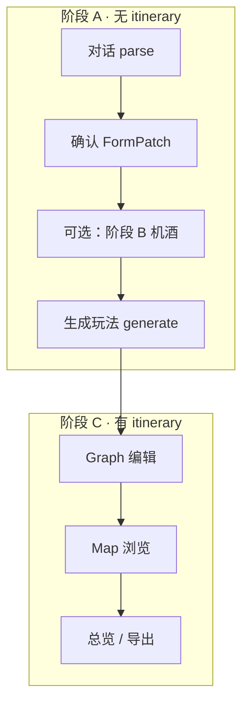

# 无路线图时预览区折叠 — UX 分析与方案

← [项目分析与设计文档](./项目分析与设计文档.md) · [10-阶段B航班UX问题分析](./llm-travel-data/10-阶段B航班UX问题分析.md) · [开发进度](./开发进度.md)

> **分析日期**：2026-07-05  
> **方法**：对照现有 `AppShell` 左右栏折叠机制、`EmptyPreview` 占位、`InputPanel` Chat strip 交互  
> **结论**：**无 itinerary 时右侧预览区应默认折叠**，让左栏（对话 / 航班 / 住宿）占满主工作区；与「地图/总览时左栏折叠」形成对称，减少无效占位与重复引导文案。

---

## 0. 问题总览

| # | 用户感知 | 根因（摘要） | 严重度 |
|---|----------|--------------|--------|
| 1 | 还没生成行程，右边一大块空白 | `PreviewPane` 始终 `flex: 1`，无 itinerary 时仅渲染 `EmptyPreview` | 中 |
| 2 | 左右都在说「去对话生成」 | `EmptyPreview` 文案与 Chat 区引导重复 | 中 |
| 3 | 对话区被挤窄，航班/住宿 Panel 也偏窄 | 左栏固定 ~40% 宽，右栏空壳仍占 ~60% | 高 |
| 4 | 与「看地图时左栏自动收起」不对称 | 仅有 `selectLeftPanelCollapsed`，无右侧等价逻辑 | 中 |

**产品判断**：在 **阶段 A（需求对话 + 解析确认）** 与 **阶段 B 前半（航班/住宿确认、尚未 generate）**，用户心智是「填表 / 聊天 / 确认机酒」，**不是**「看路线图或地图」。此时右侧预览区 **没有可展示的真实内容**，应像会话折叠条一样 **默认让出空间**。

---

## 1. 现状

### 1.1 布局结构

```
┌─────────────────────────────────────────────────────────────┐
│ Header · PlanSelector                                        │
├──────────────────┬──────────────────────────────────────────┤
│ InputPanel       │ PreviewPane                               │
│ (Chat / Flight / │ 有 itinerary → Graph / Map                │
│  Stay / Form)    │ 无 itinerary → EmptyPreview（占位文案）    │
│                  │                                           │
│ ~35–45% 宽       │ ~55–65% 宽（常为空）                       │
└──────────────────┴──────────────────────────────────────────┘
```

相关文件：

| 文件 | 行为 |
|------|------|
| `AppShell.tsx` | 左栏可 `app-shell__panel--collapsed`；右栏 **始终渲染** |
| `usePlanStore.selectLeftPanelCollapsed` | 总览 / 地图 → 左栏宽 0 |
| `PreviewPane.tsx` | `!hasItinerary` → `<EmptyPreview />` |
| `EmptyPreview.tsx` | 「开始规划你的旅程」「生成后展示标点与路线」 |

### 1.2 左栏折叠规则（已有，可类比）

```typescript
// usePlanStore.ts — selectLeftPanelCollapsed
if (editorTarget) return false;      // 编辑表头/区域 → 展开
if (mapPickNodeId) return false;     // 地图选点 → 展开
if (graphViewMode === 'overview') return true;
if (activeView === 'map') return true;
return false;
```

**设计意图**：浏览型视图（地图、总览）→ 把画布让给右侧；编辑型视图 → 左栏展开。

### 1.3 无路线图时右栏实际价值

| 阶段 | 右栏内容 | 对用户价值 |
|------|----------|------------|
| 空计划 / 仅对话 | `EmptyPreview` | **低** — 信息与 Chat 重复 |
| 已 parse、待 generate | 同上 | **低** |
| 阶段 B：航班 / 住宿 Panel | 同上（仍无 itinerary） | **低** — 用户注意力在左栏 Panel |
| generate 进行中 | 同上（进度在 ChatStatusBar） | **低** |
| generate 完成 | Graph / Map | **高** — 必须展示 |

---

## 2. 用户心智与信息架构



| 阶段 | 主任务 | 主工作区应在 |
|------|--------|--------------|
| A + B（无 itinerary） | 说需求、确认 patch、查航班、推荐住宿片区 | **左栏全宽** |
| C（有 itinerary） | 改节点、看地图、导出 | **左右分栏**（现有逻辑） |

右栏在 A/B 阶段属于 **「尚未激活的画布」**，不应与左栏平分屏幕。

---

## 3. 方案对比

### 3.1 方案 A — 自动折叠预览区（推荐）

**规则**：`!itinerary?.days.length` 时，右侧 `PreviewPane` 容器宽度为 0（或 `display: none`），左栏 `flex: 1` 占满 `app-shell__body`。

| 优点 | 缺点 |
|------|------|
| 与左栏折叠语义对称 | 需处理「用户手动展开预览」的例外 |
| 实现成本低（CSS + selector） | 移动端需单独规则 |
| 航班/住宿全高 Panel 更宽 | — |
| 去掉重复 EmptyPreview | — |

**手动展开（可选 V1.1）**：左栏底部增加 strip，类似现有「行程编辑」：

```
┌─────────────────────────────────────┐
│ Chat / Flight / Stay …              │
│                                     │
├─────────────────────────────────────┤
│ 路线预览 · 生成行程后可用      →    │  ← preview strip（折叠态可见）
└─────────────────────────────────────┘
```

### 3.2 方案 B — 保留右栏但缩为窄条

右栏固定 ~48px，仅图标 + tooltip「生成后查看路线」。

| 优点 | 缺点 |
|------|------|
| 保留「双栏产品形态」暗示 | 仍占宽度；信息密度低 |
| 无需 expand/collapse 状态 | 与左栏「完全折叠」不一致 |

### 3.3 方案 C — 合并 EmptyPreview 到左栏

删除右栏占位，把 EmptyPreview 文案移到 Chat 欢迎区。

| 优点 | 缺点 |
|------|------|
| 文案只出现一次 | **不解决** 右栏空壳占宽问题 |
| — | generate 后仍要布局跳变 |

**推荐：方案 A**。B 为折中；C 仅文案优化，非布局优化。

---

## 4. 推荐方案 A — 详细设计

### 4.1 折叠条件（自动）

新增 `selectPreviewCollapsed(state)`：

```typescript
/** 无路线图时折叠右侧预览；有 itinerary 时默认展开 */
export function selectPreviewCollapsed(state: PlanState): boolean {
  const itinerary = selectActiveItinerary(state);
  const hasItinerary = Boolean(itinerary?.days?.length);
  if (hasItinerary) return false;

  // 用户手动展开预览（可选 persisted）
  if (state.previewExpandedWithoutItinerary) return false;

  return true;
}
```

**不折叠的例外**（V1 可省略，V1.1 再加）：

| 例外 | 说明 |
|------|------|
| `previewExpandedWithoutItinerary` | 用户点击 strip 主动展开 EmptyPreview |
| `isGeneratingItinerary` | V1 **仍折叠** — 进度已在 ChatStatusBar |
| 导出 / 截图 | 无 itinerary 时不触发 |

### 4.2 与左栏折叠的联动

| 场景 | 左栏 | 右栏 |
|------|------|------|
| 无 itinerary · Chat | 全宽 | **折叠** |
| 无 itinerary · Flight/Stay | 全宽 | **折叠** |
| 有 itinerary · Graph · day | 展开（可拖拽宽） | 展开 |
| 有 itinerary · Map | **折叠** | 展开 |
| 有 itinerary · Overview | **折叠** | 展开 |
| mapPickNodeId | 展开 | 展开（地图） |

**原则**：同一时刻 **至多一栏折叠** 为主工作区让路；无 itinerary 时 **只保留左栏**。

### 4.3 AppShell 改动 sketch

```tsx
// AppShell.tsx
const leftPanelCollapsed = usePlanStore(selectLeftPanelCollapsed);
const previewCollapsed = usePlanStore(selectPreviewCollapsed);

<div className={`app-shell__panel${leftPanelCollapsed ? ' app-shell__panel--collapsed' : ''}`}
     style={leftPanelCollapsed ? undefined : { width: panelWidth, flex: previewCollapsed ? 1 : undefined }} />

<div className={`app-shell__preview${previewCollapsed ? ' app-shell__preview--collapsed' : ''}`}>
  {!previewCollapsed && <PreviewPane />}
</div>
```

```css
/* AppShell.css */
.app-shell__preview--collapsed {
  flex: 0 0 0;
  width: 0;
  min-width: 0;
  opacity: 0;
  pointer-events: none;
  overflow: hidden;
}

/* 无 itinerary 时左栏吃满剩余空间 */
.app-shell__body:has(.app-shell__preview--collapsed) .app-shell__panel:not(.app-shell__panel--collapsed) {
  flex: 1;
  max-width: none;
}
```

### 4.4 InputPanel — 预览 strip（可选，建议 V1 一并做）

对称现有 Chat 底部 strip：

| Strip | 位置 | 行为 |
|-------|------|------|
| 行程编辑 | Chat 底 | `leftPanelMode → form` |
| 航班确认 | Chat 底 | `leftPanelMode → flight` |
| 住宿片区 | Chat 底 | `leftPanelMode → stay` |
| **路线预览**（新） | Chat / Flight / Stay 底 | `setPreviewExpandedWithoutItinerary(true)` 或 generate 后自动消失 |

文案示例：

- 标题：**路线预览**
- Hint：**生成行程后查看地图与路线图**

generate 成功后 `previewExpandedWithoutItinerary` 自动清零（因已有 itinerary，selector 返回 false）。

### 4.5 EmptyPreview 去留

| 选项 | 建议 |
|------|------|
| 删除 EmptyPreview | **否** — generate 失败 / 删光所有天后仍可能需要 |
| 仅手动展开时渲染 | **是** |
| 文案缩短 | 可 — 去掉与 Chat 重复的「通过对话描述需求」 |

---

## 5. 边界与风险

| 场景 | 处理 |
|------|------|
| 用户删除全部 day | `hasItinerary` 变 false → 右栏折叠；toast「路线已清空」 |
| generate 流式返回首包 | 一旦有 `days.length > 0` → 右栏展开；可配合 `activeView: graph` |
| Mock 一键生成 | 同 generate |
| 阶段 B 仅确认航班、未 generate | 右栏折叠；符合预期 |
| 住宿片区推荐（无 itinerary 粗推） | 地图 circle 需 itinerary POI 才准；粗推时 **仍折叠**，推荐结果在 Stay Panel + 用户点「在地图查看」时再展开 |
| localStorage 恢复 | `previewExpandedWithoutItinerary` 可不持久化（V1） |
| 移动端 `@media (max-width: 960px)` | 已是上下堆叠；折叠改为 `max-height: 0`，与左栏 collapsed 一致 |

### 5.1 住宿片区与地图的特殊说明

当前 StayZonePanel 在 recommend 后会 `setActiveView('map')`。**无 itinerary 时若折叠右栏**，需二选一：

1. **推荐**：粗推 / 无 itinerary 时不自动切 map；仅 Panel 卡片 + Trip 链接。  
2. **自动展开**：`recommendStayZones` 成功且将切 map 时，临时 `previewExpandedWithoutItinerary = true` 或 `forcePreviewOpen = true`。

**建议采用 2 的窄版本**：`recommendStayZones` 若返回带 `geometry` 的 zone，则 **强制展开预览并切 map**（有内容可展示，非空占位）。

---

## 6. 实施计划

| 步 | 内容 | 文件 | 优先级 |
|----|------|------|--------|
| P0 | `selectPreviewCollapsed` + AppShell CSS | `usePlanStore.ts`, `AppShell.tsx`, `AppShell.css` | 高 |
| P0 | 无 itinerary 时不 mount PreviewPane（或 collapsed） | `AppShell.tsx` | 高 |
| P1 | Chat/Flight/Stay 底「路线预览」strip | `InputPanel.tsx`, `InputPanel.css` | 中 |
| P1 | `previewExpandedWithoutItinerary` + action | `usePlanStore.ts`, `storage.ts`（可选） | 中 |
| P1 | recommend 有 geometry 时强制展开预览 | `StayZonePanel.tsx` | 中 |
| P2 | 删除/缩短 EmptyPreview 重复文案 | `EmptyPreview.tsx` | 低 |
| P2 | 移动端 collapsed 联调 | `AppShell.css` | 低 |

**预估工作量**：P0 约 0.5d；P1 约 0.5d；不含测试与文档。

### 6.1 验收标准

1. 新建计划、仅对话 → **右栏不可见**，左栏（Chat）横向占满 body。  
2. 切换「航班确认」「住宿片区」全高 Panel → 同样占满，无右侧灰块。  
3. 点击「生成行程」且返回 days → 右栏 **平滑展开**，默认 Graph。  
4. 有 itinerary 时切 Map / 总览 → 左栏折叠、右栏展开（**回归不变**）。  
5. （P1）点击「路线预览」strip → 展开 EmptyPreview；再次 generate 或手动收起 → 恢复折叠。  
6. `npm run build` 通过；手动走一遍阶段 B → generate → 编辑。

---

## 7. 与现有文档的关系

| 文档 | 关联 |
|------|------|
| [10-阶段B航班UX](./llm-travel-data/10-阶段B航班UX问题分析.md) | 航班 Panel 需全宽；本方案解决「无 itinerary 时右栏抢宽」 |
| [13-阶段B住宿区域实施计划](./llm-travel-data/13-阶段B住宿区域实施计划.md) | 地图 circle 展示需与「强制展开预览」联动（§5.1） |
| [项目分析与设计文档 §11.2](./项目分析与设计文档.md) | 「左面板可收起」已部分实现；本方案补 **右栏可收起** 对称 |

---

## 8. 结论

| 问题 | 建议 |
|------|------|
| 无路线图时右侧是否展示？ | **默认不展示（折叠）** |
| 是否与对话折叠类似？ | **是** — 同一套 `app-shell__*--collapsed` 模式 + 可选 bottom strip |
| 何时展开？ | 有 `itinerary.days`；或用户点「路线预览」；或住宿推荐要带 map 的强制展开 |
| 首要改动 | `selectPreviewCollapsed` + `AppShell` 右栏 collapsed 样式 |

---

*文档版本：v1.0 · 2026-07-05 · 待 P0 实施*

> **待办追踪**：[docs/TODO.md](./TODO.md) · 本主题项：[TODO-布局与前端.md](./TODO-布局与前端.md) `UX-14-01`～`UX-14-07`
