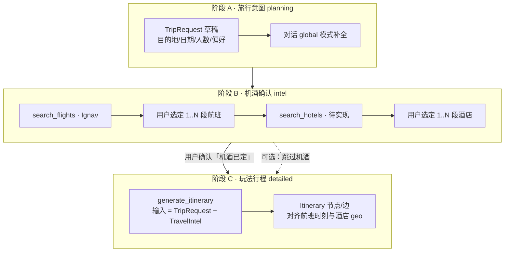
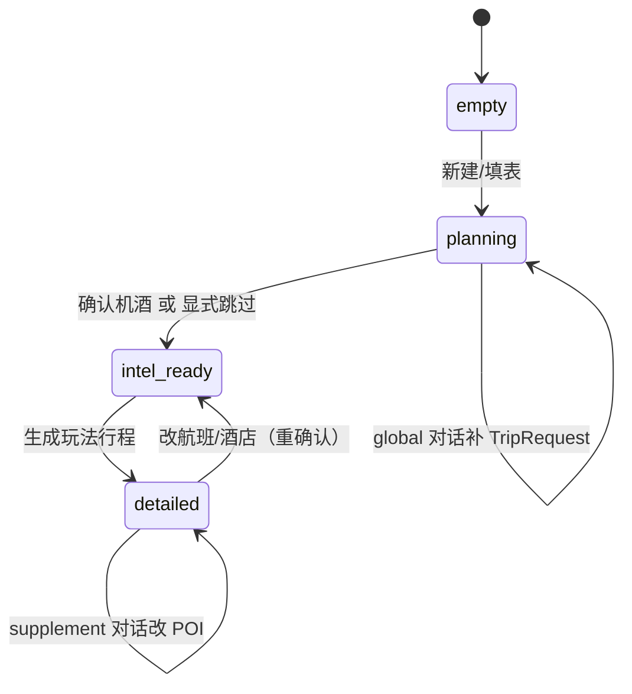

# 机酒确认与行程生成流程方案

← [返回索引](./README.md) · 相关：[00-概述与架构.md](./00-概述与架构.md) · [Ignav 验证报告](./01-航班信息-Ignav验证报告.md) · [02-酒店信息.md](./02-酒店信息.md)

> **版本**：v1.0 · **日期**：2026-07-03  
> **背景**：Ignav Spike Go 3/3，可 App 内查价；需明确**接入位置**与**整体用户流程**，避免与「先定机酒、再生成玩法行程」的产品理解冲突。

---

## 1. 你的理解 vs 现状

### 1.1 你的理解（产品目标）

| 要点 | 说明 |
|------|------|
| 查价与生成 **可分开** | 先搜航班/酒店、对比、确认；不必与「生成行程」同一步 |
| 生成 **之前** 应有机酒锚点 | 玩法行程应围绕**已选航班时刻、酒店位置**排布，而非 LLM 凭空假设 |
| 多段航班 | 往返、经停、多城衔接（如 上海→新加坡→吉隆坡→上海） |
| 多酒店 | 同城换店、多城各一家、延长停留分段入住 |

**结论：该理解与 [00-概述与架构.md §2](./00-概述与架构.md#2-总体架构建议) 的设计意图一致，但与当前主 App 实现不一致。**

### 1.2 现状（主 App）

```
TripRequest（表单/对话）
        ↓  用户点「生成行程」
POST /itineraries/generate
        ↓  LLM 直接输出 Itinerary（POI + 时间轴）
phase: empty → planning → detailed
```

| 能力 | 状态 |
|------|------|
| `TripRequest` | ✅ 仅有 departure/destination/日期/偏好，**无已选航班/酒店** |
| `TravelPlan` | ✅ 含 trip_request + itinerary；**无 travel_intel 层** |
| 航班搜索 | ⏸ 独立 dev 页 `flight-verify.html`，**未接入主流程** |
| 酒店搜索 | ❌ 未实现 |
| `Itinerary.meta.flight_quotes` | 📄 文档草案，**前端类型未扩展** |
| generate 入参 | 仅 `trip_request`，**不传已确认机酒** |

因此：**接入 Ignav 若只挂在 generate 同步调用里，会加剧「一次生成包办一切」的错觉，且无法支撑多段航班/多酒店确认。**

---

## 2. 目标流程（推荐：三阶段 + 可选快捷路径）

### 2.1 主路径（与你描述一致）



**阶段 B 与 C 解耦**：

- B 可在 App 内完成（Ignav 报价 + LLM 推荐 + 用户点选确认），**无需跳转查价**；Trip.com 仅作「去预订」CTA。
- C 的 LLM **不再负责搜票价**，只消费 `TravelIntel` 里的锚点约束排程。

### 2.2 快捷路径（保留灵活性）

与「不一定要先确定机票」一致，产品应支持：

| 模式 | 行为 |
|------|------|
| **标准** | 至少确认 **去程航班 + 首晚酒店** 后才允许 generate（或强提示） |
| **玩法先行** | 用户显式勾选「机酒稍后补充」→ generate 时 `meta.warnings` 标注，Day1 用占位 airport/hotel |
| **仅确认航班** | 先生成以航班时刻为硬约束的行程，酒店后补 patch |

快捷路径需 **用户主动选择**，避免 LLM 静默假设。

---

## 3. 数据模型：TravelIntel（新增，挂在 TravelPlan）

与 `Itinerary` 分离：**机酒是生成前的约束层**，生成后写入 `Itinerary` 节点 + `meta` 快照。

### 3.1 TravelPlan 扩展

```typescript
type PlanPhase = 'empty' | 'planning' | 'intel_ready' | 'detailed';
// intel_ready = 用户已确认机酒（或显式跳过），可点「生成玩法行程」

interface TravelPlan {
  // ...existing
  trip_request: TripRequest;
  travel_intel: TravelIntel;      // 新增
  itinerary: Itinerary | null;
}

interface TravelIntel {
  status: 'draft' | 'partial' | 'confirmed' | 'skipped';
  confirmed_at?: string;
  skip_reason?: string;           // 用户选择玩法先行时

  flights: ConfirmedFlightLeg[];
  hotels: ConfirmedHotelStay[];

  /** 搜索缓存，未确认前的候选 */
  flight_search_sessions?: FlightSearchSession[];
  hotel_search_sessions?: HotelSearchSession[];

  provenance?: DataProvenance[];
}
```

### 3.2 多段航班：`ConfirmedFlightLeg[]`

每段 **独立一条**，用 `sequence` 排序；往返 = 2 条，多城 = N 条。

```typescript
interface ConfirmedFlightLeg {
  id: string;
  sequence: number;               // 1=去程, 2=回程, 3=城际…

  role: 'outbound' | 'return' | 'intercity' | 'other';

  origin_iata: string;
  dest_iata: string;
  depart_at: string;                // ISO8601
  arrive_at: string;

  airline: string;
  flight_numbers?: string[];
  stops: number;
  duration_minutes: number;

  /** 绑定的报价快照（来自 Ignav） */
  quote: FlightQuote;
  quote_id: string;

  /** 预订 */
  purchase_url?: string;            // Trip.com showfarefirst 或航司链
  booking_status: 'selected' | 'booked_external';

  /** 约束标记 */
  is_anchor: boolean;               // generate 时作为硬约束
}
```

**多线示例（上海↔新加坡，中途吉隆坡 3 天）**：

| sequence | role | 航线 | 日期 |
|----------|------|------|------|
| 1 | outbound | PVG→SIN | 10-16 |
| 2 | intercity | SIN→KUL | 10-19 |
| 3 | intercity | KUL→PVG | 10-22 |

每段独立 `search_flights` → 用户各选一条 → 写入 `flights[]`。

### 3.3 多酒店：`ConfirmedHotelStay[]`

按 **入住区间 + 城市** 分段，支持同城换店、多城各店。

```typescript
interface ConfirmedHotelStay {
  id: string;
  sequence: number;

  city: string;                     // 或 region，与 Itinerary 对齐
  name: string;
  check_in: string;                 // YYYY-MM-DD
  check_out: string;

  lat?: number;
  lng?: number;
  address?: string;

  quote?: HotelQuote;               // Phase 1 可为 deep link + 手工名
  quote_id?: string;

  is_primary: boolean;              // 该城主酒店
  is_anchor: boolean;
  booking_status: 'selected' | 'booked_external';
}
```

**与天数关系**：

- `check_in/check_out` 须落在 `trip_request.date_start/date_end` 内（校验器负责）
- 多段酒店 **间隙** → generate 时 LLM 需知「10-19～10-20 无固定酒店」或用户补第二家

### 3.4 生成时的输入契约

```typescript
interface GenerateItineraryRequest {
  trip_request: TripRequest;
  travel_intel: TravelIntel;        // 新增，必填但可 status=skipped
  geocode?: boolean;
}
```

**LLM System 硬约束（摘要）**：

1. Day1 第一个节点须衔接 `flights[0].arrive_at`（或出发前去机场边）
2. **日闭环（P88）**：普通日 `hotel→…→hotel`；抵达日 `airport→…→hotel`；离开日 `hotel→…→airport`；酒店名与 `hotels[]` 逐字一致（后端 `intel_anchor_enforce` 校准）
3. 默认早/午/晚三餐；不得修改已确认航班时刻/酒店名；仅排 POI 与市内交通
4. `cross_day_edges[]` 衔接日末→日首（含酒店隔夜）；跨日航班边可用 `transport_mode: 'flight'`
5. **生成前门禁**：须已锁定具体酒店（名+坐标）写入 `travel_intel.hotels`（仅片区不够）
6. **时刻硬校准（P94 / B-P4-05）**：generate 后 `hotels → flights → cascade`——机场 `start/end` 对齐确认 `arrive_at`/`depart_at`（含出关/值机缓冲），同日其余节点接龙对齐；POI 停留仍非营业时间真相源

---

## 4. Ignav 在流程中的位置

**Ignav 只服务阶段 B**，不嵌入 `/itineraries/generate` 同步链路。

```
阶段 B：
  用户描述 / 表单 → search_flights (Ignav)
                 → ranked[] + LLM 推荐
                 → 用户「确认选用」→ ConfirmedFlightLeg
                 → purchase.url (Trip.com) 可选点击

阶段 C：
  generate 只读 travel_intel.flights[].quote 快照
  不再调用 Ignav（除非用户改日期重搜）
```

| 项 | 说明 |
|----|------|
| API | 迁入 `backend/.../ignav_provider.py`，复用 Spike normalize |
| 预订 | Trip.com Deep Link 写入 `purchase_url`；Ignav `booking-links` 作备选 |
| 缓存 | 同 `(origin,dest,date)` 15～30min |
| 失败 | Ignav 失败不阻塞 B 阶段其他段；可换 LetsFG fallback |

---

## 5. UI / 阶段状态机（TravelPlan.phase）



**左侧表单分区建议**（与现有 FormBlock 对齐）：

| 区块 | 阶段 | 内容 |
|------|------|------|
| 旅行意图 | A | 现有 TripRequest 字段 |
| **航班** | B | 段列表 + 搜/选/确认；支持「添加航段」 |
| **酒店** | B | 段列表 + 搜/选/确认；支持「添加入住段」 |
| 生成 | C | 「生成玩法行程」按钮；gate 见 §2.2 |

**「生成行程」按钮文案拆分**：

- 阶段 B 前：**禁用或引导**「请先确认航班与酒店」
- 阶段 B 后：**生成玩法行程**（明确不是搜机票）

---

## 6. 与现有模块的关系

| 模块 | 变更 |
|------|------|
| `TravelPlan` / `usePlanStore` | +`travel_intel`；phase 增 `intel_ready` |
| `POST /itineraries/generate` | 入参 +`travel_intel`；Prompt 注入锚点 |
| `POST /api/v1/flights/search` | 阶段 B 调用；返回 ranked + Trip CTA |
| `flight-verify.html` | 逻辑迁入主 App「航班」区块后 **废弃** |
| `chat/parse` global | 仍只改 TripRequest；**不**直接写 ConfirmedFlight |
| `chat/parse` supplement | 可改 itinerary；改机酒应回阶段 B 重确认 |
| `Itinerary.meta` | 生成时快照 `flight_quotes` / `hotel_quotes` 副本 |

---

## 7. 分期实施（Ignav 接入顺序）

| 期 | 范围 | 产出 |
|----|------|------|
| **P0** | 文档 + 类型 | 本文、`TravelIntel` TS/Pydantic 草案 |
| **P1** | 后端 Ignav + flights API | `ignav_provider`；`/flights/search` 默认 Ignav |
| **P2** | 前端阶段 B「航班」| 单段搜选确认；`travel_intel.flights[0]` |
| **P3** | 多段航班 UI | 添加航段、sequence、往返/多城模板 |
| **P4** | generate 接入 intel | 硬约束 Prompt + airport 节点绑定 |
| **P5** | 住宿片区 | **P5z** [12 方案](./12-阶段B住宿区域倒推方案.md) · [13 实施](./13-阶段B住宿区域实施计划.md)；P5b OTA 可选 |
| **P6** | 多酒店 + 校验 | 日期覆盖、间隙警告、总览图 cross_day |

**不建议**：P1 未完成 TravelIntel 模型前，把 Ignav 塞进现有 generate 按钮。

### 7.1 实施状态（2026-07-03）

| 期 | 状态 | 产出 / 路径 |
|----|------|-------------|
| **P0** | ✅ | 本文、`frontend/src/types/travelIntel.ts` |
| **P1** | ✅ | `backend/app/services/flight/ignav_provider.py`；`search.py` 默认 Ignav；`config.py` `FLIGHT_INCLUDE_IGNAV`；`scripts/test_flight_ignav_parse.py` |
| **P2** | ✅ | `FlightIntelPanel`（`leftPanelMode: flight` 全高）；`usePlanStore` 确认/移除航段；`storage` v3 + `travel_intel` 迁移；generate 未确认航班 warning |
| **P2b** | ✅ | 往返 Ignav 组合（`return_leg` + 一次确认两程）；`flight_numbers`；偏好 `rank_reason` |
| **P2c** | ✅ | 中文航线 + 手动添加（[09](./09-阶段B航班功能实施计划.md)） |
| **P3** | ✅ | 多航段模板、城际快捷入口 | → **B-P3-01/02** [TODO](./TODO.md) |
| **P3-UX** | ✅ | 左栏 `flight` 模式、确认后 CTA、stale 搜索、与 Chat 分离（[10-UX](./10-阶段B航班UX问题分析.md)） |
| **P4** | ⏳ | generate 读 `travel_intel` + Prompt 硬约束 | → **B-P4-01** [TODO](./TODO.md) |
| **P5** | ✅ | 住宿片区倒推 **P5z 全量**（[12](./12-阶段B住宿区域倒推方案.md) · [13](./13-阶段B住宿区域实施计划.md)）；P5b OTA 可选 |
| **P6** | ⏳ | 多酒店 + 校验 | B-P6-01 ✅ 软警告 · B-P6-02 总览对齐 🔲 |

**P2 交互路径**：对话栏「航班确认」或搜索自动切 `flight` → 搜航班（Ignav）→ 选报价「确认选用/往返」→ `travel_intel.flights[]` → 自动切 `form` → 可选 Trip.com CTA → 「生成玩法行程」（无航班仅 warning，不阻塞）。

---

## 8. 产品决策（已确认 2026-07-03）

| 问题 | 决策 |
|------|------|
| **Q1 生成门槛** | **B — 始终允许生成**，未确认机酒时 `meta.warnings` 强提示；不硬阻塞「生成玩法行程」 |
| **Q2 多目的地** | **单计划、单国家**：可在该国多城（如泰国曼谷+清迈）；**不做跨国组合**（新马分开或 fork 新计划） |
| **Q3 酒店 Phase 1** | **A — 航班 Ignav 跑通后再做酒店 API**；此前 generate 可仅用航班锚点或 warning |

### 8.1 对流程的影响

**生成门槛 B**：

- `TravelIntel.status` 仍记录 `draft | partial | confirmed | skipped`，但 **不 gate 按钮**
- LLM generate Prompt：有 confirmed 航班/酒店 → 硬约束；无 → 占位节点 + `warnings: ["未确认机酒，时刻与住宿为估算"]`
- 阶段 B UI 仍鼓励先确认，属于「推荐路径」非「强制路径」

**单国家多城**：

- `TripRequest.destination` 保持 **主目的地城市/区域**；`travel_intel.flights[]` 用 `intercity` 段衔接国内跨城
- 若用户要去第二个国家 → **fork 新 TravelPlan** 或新建计划（与 §3.5.5 一致）
- 校验：`ConfirmedFlightLeg` 的 `origin/dest` 国家码须一致（或终到国 = 计划国）

**酒店滞后 / 住宿片区**：

- P1～P4 只做 **航班阶段 B + Ignav + generate 读航班锚点**
- P5z：**行程倒推住宿片区** → 地图画范围 → 按路线图添加 hotel 节点（[12 §5.1](./12-阶段B住宿区域倒推方案.md)）
- P4 之前 hotel 节点由 LLM 按区域推荐 + `cost_label: "待确认片区"`

---

## 9. 待后续细化（可选）

- 单国家判定：用 IATA 城市 → 国家码表（与 `city_codes.json` 扩展）
- 「同城多酒店换店」是否 Phase 1 支持手工录入 — 待酒店 API 阶段一并设计

---

## 10. 结论

| 问题 | 答案 |
|------|------|
| 接入 Ignav 会不会改流程？ | **会，且应该改** — 从「一键生成」变为「意图 → 机酒确认 → 玩法生成」 |
| 查价要不要跳转？ | **不用** — Ignav 在阶段 B App 内完成；Trip.com 仅预订 CTA |
| 能否先不定机票？ | **可以（已确认 B）** — 随时 generate，warning 标注；有机酒时约束更强 |
| 多段航班/多酒店？ | **`TravelIntel.flights[]` + `hotels[]`**；**单国家**内多城用 intercity 段 |

---

*机酒确认与行程生成流程 · v1.1 · 2026-07-03 · P1/P2 已落地*

> **待办追踪**：[TODO.md](./TODO.md) · [总索引](../TODO.md)
