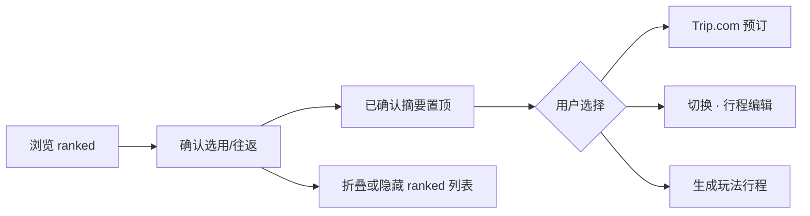

# 阶段 B 航班 UX 问题分析

← [返回索引](./README.md) · [09-阶段B功能实施计划](./09-阶段B航班功能实施计划.md) · [06-机酒确认流程](./06-机酒确认与行程生成流程方案.md) · Skill：[ai-chat-ui](../../../.cursor/skills/ai-chat-ui/SKILL.md)

> **分析日期**：2026-07-03 · **实施日期**：2026-07-03  
> **方法**：对照 ai-chat-ui 布局约定 + 现有 `InputPanel` / `ChatPanel` / `FlightIntelPanel` 实现  
> **结论**：航班确认不应长期嵌在对话栏内；确认后需**明确后续动作 + 视图切换**。**P3 已实施**（方案 A）。

---

## 0. 问题总览

| # | 用户反馈 | 根因（摘要） | 严重度 |
|---|----------|--------------|--------|
| 1 | 确认往返航班号后无后续操作 | 仅 toast；无 CTA、无折叠结果、无 phase/视图切换 | 高 |
| 2 | 搜索的时候前端清空 | 新 `setFlightSearchResult` 覆盖旧 ranked；loading 无占位；布局滚动像「被清空」 | 中 |
| 3 | 卡片裁切严重，难看完 | 航班嵌在 Chat 内 `max-height: 38vh`；与对话抢空间 | 高 |
| 4 | 选择航班后需要切换 | 无 `leftPanelMode` / 阶段视图切换；仍停在对话模式 | 高 |

**产品判断（用户建议采纳）**：搜出航班后，用户心智是「选课表」而非「聊天」——**航班 UI 与会话区分离**比继续挤在同一栏更合理。

---

## 1. 问题一：确认往返后无后续操作

### 1.1 现状

```
confirmFlightQuote(quoteId)
  → flightLegsFromQuote（往返写 2 条 ConfirmedFlightLeg）
  → syncTravelIntelStatus（status → partial）
  → toast「已确认往返航段」
  → （结束）
```

| 项 | 确认后行为 |
|----|------------|
| `last_flight_search.ranked` | **仍完整展示**，卡片仍可点「确认往返」 |
| `travel_intel.flights` | 已写入去程+回程 |
| `TravelPlan.phase` | **不变**（仍 `planning`，未进 `intel_ready`） |
| 左侧视图 | **不变**（仍 `leftPanelMode: chat`） |
| 下一步 CTA | **无**（无「生成玩法」「去 Trip 预订」「继续编辑行程」） |

相关代码：`usePlanStore.confirmFlightQuote` 仅 toast；`FlightIntelPanel` 无「已选」态与结果区折叠。

### 1.2 用户期望

确认往返 = **完成阶段 B 的一个里程碑**，应看到：

1. 已选组合与候选列表区分开（高亮 / 折叠 / 移除重复确认入口）
2. **明确下一步**，例如：
   - 「打开 Trip.com 预订」
   - 「继续确认酒店」（P5 后）
   - 「生成玩法行程」/「展开行程编辑」
3. 可选：将 `travel_intel.status` 或 `phase` 推进到 `intel_ready`（与方案 06 一致，软 gate）

### 1.3 推荐方案

**确认后状态机（单段/往返通用）**



| 改动 | 说明 |
|------|------|
| `confirmFlightQuote` 后 | `last_flight_search` 增加 `confirmed_quote_id` 或清空 `ranked` 显示 |
| UI | 结果区顶部展示 **「已选往返 · USD xxx」** + 主按钮区 |
| CTA 文案 | 主：**继续编辑行程**（切 form）；次：**Trip.com 预订**；可选：**生成玩法行程** |
| 往返 | 两条 leg 已在「已确认航段」列表；CTA 一次即可，勿重复「确认往返」 |

---

## 2. 问题二：搜索时前端「清空」

### 2.1 现象拆解

用户说的「清空」可能对应以下**多种实际行为**（需统一修复）：

| 现象 | 代码原因 | 是否 bug |
|------|----------|----------|
| 新搜索返回后，上次推荐列表消失 | `setFlightSearchResult({ ranked: res.ranked })` 全量替换 | 预期，但无过渡 |
| 新搜索返回 `ranked: []` | 覆盖为空，列表整块消失 | ⚠️ 体验差 |
| 点击搜索后界面「闪一下」 | loading 无 skeleton；错误时仅 local `error` | ⚠️ |
| 搜索时对话/上方内容看不见 | `chat-panel__intel` 限高 + 滚动复位 | 与问题 3 同源 |
| 已确认航段被清 | **不会**（`flights[]` 独立） | 非 bug |

`handleSearch`（`FlightIntelPanel.tsx`）在请求**开始**时未清空 ranked，但**结束**时用新 session **覆盖** `last_flight_search`；若 Ignav 慢或失败，用户长时间只看旧列表或突然变空。

### 2.2 推荐方案

| 优先级 | 改动 |
|--------|------|
| P1 | 搜索开始：`loading` + **保留旧 ranked** 并加半透明遮罩 / 「更新中…」 |
| P1 | 仅当新结果 **成功且非空** 时替换 ranked；失败保留旧 session + 错误提示 |
| P2 | 请求 key 变化时显示「上次搜索：xxx · 点击恢复」 |
| P2 | 不清空 `intel.flights`（已保证，文档化以免回归） |

---

## 3. 问题三：卡片裁切严重 — 是否应与对话分离

### 3.1 现状布局

```
InputPanel (leftPanelMode: chat | form)
└─ ChatPanel (flex column, overflow hidden)
   ├─ head + ChatStatusBar
   ├─ chat-panel__intel  max-height: min(38vh, 320px)  ← 航班挤在这里
   ├─ chat-panel__main    flex 1（对话消息）
   └─ chat-panel__dock    输入框 + Patch
```

`FlightIntelPanel` 单块内容包含：

- 已确认航段列表
- 搜索表单（多行）
- 手动添加（展开后更长）
- 往返推荐卡片（每条含去程+回程两行）

在 320px 限高内滚动，**往返卡片 + 表单**很难「一眼看全」，且与 ai-chat-ui 的「消息区 flex:1」争抢空间。

### 3.2 与 ai-chat-ui 的冲突

| ai-chat-ui 约定 | 当前阶段 B |
|-----------------|-------------|
| 消息区占满中间、可滚动 | 中间被 intel 占 38vh |
| Composer 固定底 | ✅ |
| 任务型确认（Patch）与对话并列 | 航班确认比 Patch **更重**，却嵌在同一栏 |

**结论**：用户判断正确——**搜出航班后对话优先级下降**，继续嵌在 Chat 内是结构性问题，非再调 `max-height` 能根治。

### 3.3 推荐架构：左栏三态（或二态 + 全屏航班）

#### 方案 A（推荐）：扩展 `leftPanelMode`

```typescript
type LeftPanelMode = 'chat' | 'flight' | 'form';
```

| 模式 | 内容 | 何时进入 |
|------|------|----------|
| `chat` | 纯对话 + Patch + Composer | 默认；阶段 A 补 TripRequest |
| `flight` | **全高** `FlightIntelPanel`（无 Composer） | 点击「航班确认」/ 首次搜索 / 有 ranked |
| `form` | 行程编辑 | 确认航班后 CTA / 原有 strip |

```
┌─ flight 模式 ─────────────────┐
│ 航班确认（100% 高度，可滚动）   │
│ · 已确认航段                   │
│ · 搜索 + 结果（无 38vh 限制）   │
│ · 手动添加                     │
├─ 底栏固定 ────────────────────┤
│ [返回对话] [Trip.com] [继续→]  │
└───────────────────────────────┘
```

#### 方案 B（轻量）：Chat 内 Tab

ChatPanel 顶：`对话 | 航班` Tab；选「航班」时隐藏 `chat-panel__main` + `dock`，intel 占满。**改动小于 A**，但概念上仍混在 Chat 组件内。

#### 方案 C（维持嵌套，仅缓解）

- intel `max-height` 提到 `55vh` 或确认后自动折叠表单  
- **不推荐**作终态，仅作过渡。

### 3.4 与「搜完不需要对话」的产品规则

| 阶段 | 主界面 |
|------|--------|
| A 意图收集 | `chat` |
| B 搜价/确认 | **`flight`**（自动切换或强提示切换） |
| B 已确认 | `flight` 显示 CTA → **`form`** |
| C 玩法生成后 | `chat`（supplement）+ `form` |

---

## 4. 问题四：选择航班后需要切换

### 4.1 现状

| 事件 | `leftPanelMode` | 用户所见 |
|------|-----------------|----------|
| 确认 Ignav / 手动航段 | **不变**（通常 `chat`） | 仍在对话栏，底部仍有 Composer |
| 选中地图节点 | 切 `form` | 有（与航班无关） |
| Patch 确认 | 常触发 `generateItinerary` | 与航班确认 **脱节** |

航班确认与对话/表单 **无联动**，违反方案 06「阶段 B → C」路径。

### 4.2 推荐切换规则

| 触发 | 切换 |
|------|------|
| 用户点击「搜索航班」且首次 | `chat` → `flight`（或 Tab=航班） |
| `confirmFlightQuote` / `addManualFlightLeg` 成功 | 停留 `flight` 1.5s 展示摘要 → 弹 **「已确认，是否继续编辑行程？」** → 默认切 `form` |
| 用户点「返回对话」 | `flight` → `chat` |
| `phase === detailed` | 隐藏 `flight` 模式入口（与现逻辑一致） |

Store 改动 sketch：

```typescript
confirmFlightQuote: (...) => {
  // ... existing leg write
  set({ leftPanelMode: 'flight' }); // 若尚未
  // optional: after confirm, suggest form
  set({ leftPanelMode: 'form', flightIntelStep: 'confirmed' });
}
```

`InputPanel.tsx` 增加 `showFlight` 分支渲染全高 `FlightIntelPanel`。

---

## 5. 统一实施建议（P3 UX）

### 5.1 迭代顺序

| 步 | 内容 | 解决 |
|----|------|------|
| 1 | `leftPanelMode: 'flight'` + InputPanel 全高航班视图 | #3 #4 |
| 2 | 搜索 loading 保留旧结果 + 确认后 CTA 条 | #1 #2 |
| 3 | 确认后折叠 ranked / 标记已选 | #1 |
| 4 | `intel_ready` 软标记 + 表单区「生成玩法」入口 | #1 #4 |

### 5.2 涉及文件（预估）

| 文件 | 改动 |
|------|------|
| `usePlanStore.ts` | `leftPanelMode` 扩展；confirm 后切换；search session 合并策略 |
| `InputPanel.tsx` | 三态布局；底栏 CTA |
| `ChatPanel.tsx` | 移除 `chat-panel__intel`（航班迁出） |
| `FlightIntelPanel.tsx` | 确认后 UI；loading 态；`onConfirmed` 回调 |
| `Chat.css` | 删除或保留 intel 限高（若 Tab 方案则改 Tab 样式） |
| `travelIntel.ts` | 可选 `FlightSearchSession.confirmed_quote_ids` |

### 5.3 验收标准

- [x] 往返确认后出现至少 2 个可见 CTA（预订 / 继续）
- [x] 搜索中旧结果不无故消失；失败不清空上次成功 ranked
- [x] 航班结果区在 `flight` 模式下可**不滚动或轻滚动**看完 3 条往返卡片
- [x] 确认后自动或一键切到 `form`，用户能继续编辑或生成

### 5.4 实施摘要（2026-07-03）

| 改动 | 路径 |
|------|------|
| `LeftPanelMode = 'chat' \| 'flight' \| 'form'` | `usePlanStore.ts`、`storage.ts` |
| 全高航班视图 + 底栏 CTA | `InputPanel.tsx`、`InputPanel.css` |
| 移出 Chat | `ChatPanel.tsx`（删除 `chat-panel__intel`） |
| stale 搜索 + 确认态 | `FlightIntelPanel.tsx`、`mergeFlightSearchResult` |
| session 字段 | `FlightSearchSession.confirmed_quote_id`、`hide_ranked` |
| 头部状态 badge | `getFlightIntelPanelPhase`：阶段 B → 待确认 → **已完成** |
| 移除航段同步 | `syncFlightSearchAfterLegRemoval`；已选卡片改读 `intel.flights` |

### 5.5 补充修复（2026-07-03 · P3.1）

| # | 反馈 | 根因 | 修复 |
|---|------|------|------|
| 5 | 确认后状态框无「完成」 | 头部 badge 固定「阶段 B」 | `FlightIntelPanelPhase`：`idle` / `pending` / `done`；badge 显示 **已完成**（绿） |
| 6 | 删除航段后已选卡片未同步 | `removeFlightLeg` 未清 `confirmed_quote_id`/`hide_ranked`；卡片读 ranked 缓存 | `syncFlightSearchAfterLegRemoval`；往返 bundle 一次移除两程；`ConfirmedFlightsSummary` 绑定 `intel.flights` |

**验收**：

- [x] 确认航段后 badge 为「已完成」，Panel 边框变绿
- [x] 移除全部航段后，已选摘要消失、推荐列表重新展示
- [x] 移除往返 bundle 中任一程时，去程+回程一并清除

---

## 6. 与现有文档关系

| 文档 | 更新 |
|------|------|
| [09-阶段B航班功能实施计划](./09-阶段B航班功能实施计划.md) | §4 P3-UX 交付记录 |
| [06-机酒确认流程](./06-机酒确认与行程生成流程方案.md) | P3-UX ✅ |
| [ai-chat-ui SKILL](../../../.cursor/skills/ai-chat-ui/SKILL.md) | 可选：补充「重任务 Panel 不与 Composer 同栏」 |

---

## 7. 结论

| 问题 | 是否认同 | 推荐方向 |
|------|----------|----------|
| 1 确认后无后续 | ✅ | 确认态 + CTA + 折叠 ranked |
| 2 搜索清空 | ✅ | stale-while-revalidate；失败不覆盖 |
| 3 裁切 / 分离 | ✅ | **`leftPanelMode: flight` 全高**，移出 Chat |
| 4 选择后要切换 | ✅ | 确认后 → `form`；搜索时 → `flight` |

**不建议**继续在 `chat-panel__intel` 上叠 `max-height` 修修补补；**建议**按阶段 B 独立视图做 P3。

---

*文档版本：v1.2 · 2026-07-03 · P3 + P3.1 已实施*
