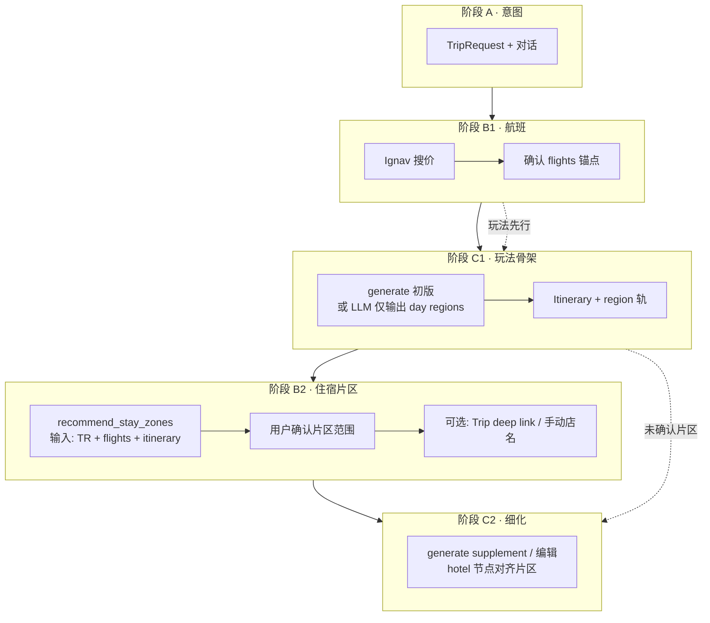
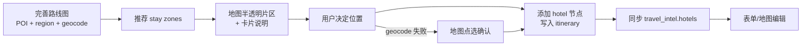

# 阶段 B 住宿 — 行程倒推区域方案（修订）

← [返回索引](./README.md) · [11-酒店对称分析（初版）](./11-阶段B酒店对称方案分析.md) · [06-机酒确认流程](./06-机酒确认与行程生成流程方案.md) · [02-酒店信息](./02-酒店信息.md)

> **分析日期**：2026-07-03  
> **触发**：产品讨论 — 酒店位置是否应来自**行程/玩法**，而非独立搜价  
> **结论**：**是，更好。** 推荐从「搜具体酒店」改为「**确认航班 → 倒推推荐住宿区域 →（可选）具体酒店/ deep link**」；默认权重 **公共交通方便**，后续用表单扩展偏好。

---

## 0. 结论摘要

| 问题 | 答案 |
|------|------|
| 倒推区域是否比对称航班搜酒店更好？ | ✅ **对 Phase 1 更合适** |
| 与现有架构冲突吗？ | ⚠️ 需**微调阶段顺序**，不推翻 TravelIntel |
| 还需要 `ConfirmedHotelStay` 吗？ | ✅ 需要，但**先确认区域，后补具体店名** |
| 还需要 OTA ranked 搜价吗？ | ⏳ **降为 P5b 可选**，非主路径 |

**核心判断**：航班是**时刻锚点**（先定合理）；酒店是**空间锚点**（应服从「每天去哪玩」）。在**没有玩法骨架前**让用户选酒店，容易选错片区、增加跨区通勤 —— 与 [02-酒店 §1](./02-酒店信息.md)「与行程区域聚类对齐」一致，但原 [06 §2.1](./06-机酒确认与行程生成流程方案.md) 的 B3→B4 **在 generate 之前**订酒店，与此目标**相反**。

---

## 1. 两种路径对比

### 1.1 原方案（对称航班 · [11 初版](./11-阶段B酒店对称方案分析.md)）

```
意图 → 搜航班 → 确认航班 → 搜酒店 → 确认酒店 → generate 玩法
                              ↑
                         尚无 POI 聚类，选区靠猜
```

### 1.2 修订方案（行程倒推 · 推荐）

```
意图 → 搜航班 → 确认航班
              → 生成/草拟行程（含 Day.region、节点片区）
              → 系统推荐「适合居住的片区范围」
              → 用户确认片区（+ 后续表单偏好）
              → （可选）Trip.com 带区域筛选 / 手动填店名
              → 细化行程（酒店节点对齐片区）
```

| 维度 | 对称搜酒店 | 行程倒推片区 |
|------|-----------|--------------|
| 与 POI 距离 | 弱 | **强** |
| 依赖 OTA API | 高 | **低**（LLM + 区域知识即可 Phase 1） |
| 用户认知 | 「先订房再玩」 | **「先定玩法的中心再住附近」** |
| 多城/换店 | 手工多段 | 按 **city × 日期段 × 片区** 自然分段 |
| 与总览 `region` 轨 | 弱 | **直接复用** `DayPlan.region` / 节点 `region` |

---

## 2. 为什么「先区域、后酒店」更合理

### 2.1 业务差异（航班 vs 住宿）

| | 航班 | 住宿 |
|---|------|------|
| 约束类型 | 时间（不可压缩） | 空间（可换区但增加通勤） |
| 错误成本 | 改签贵 | 选错区 = **每天多 30～60min 通勤** |
| 信息来源 | Ignav 可结构化 | Phase 1 无可靠库存 API |
| 最优输入 | TripRequest 日期 + 城市对 | **已规划 POI 分布 + 交通网** |

### 2.2 与现有数据模型契合

项目已有：

- `TripRequest`：目的地、日期、`preference_tags`
- `Itinerary.days[].region` + 节点级 `region`（[itinerary_llm.py](../../../backend/app/services/itinerary_llm.py) 规则 6）
- 总览图 **区域轨**（`OverviewGraphView` region rail）
- `ConfirmedFlightLeg[]`：抵达/离开时刻 → 约束 **首晚/末晚** 片区（近机场 vs 市区）

倒推片区 = 在这些结构上加 **推荐层**，而非另起一套搜酒店 UI。

### 2.3 默认「公共交通方便」

作为 **Phase 1 默认权重** 合理：

- 境外自由行主流诉求；新加坡/东京/曼谷等可表述为「近 MRT/BTS/地铁枢纽」
- 不依赖 OTA；可用 LLM 区域知识 +（可选）geocode 后算站点距离
- 与后续表单扩展自然衔接：**权重向量**，而非写死规则

| 偏好（后续表单） | 对片区打分的影响 |
|------------------|------------------|
| 公共交通方便（默认） | 枢纽 500m～1km 圈层加分 |
| 安静 / 亲子 | 减分闹市区、加分居民区 |
| 海景 / 地标景观 | 滨海/河畔/观景加分 |
| 预算经济 | 偏外围枢纽；奢华偏核心商圈 |
| 少换酒店 | 多城行程合并为 **一个** 最大重叠片区 |

### 2.4 片区因什么而定？（每天行程不同时）

> **核心问题**：酒店是 **少量固定点**，玩法是 **按天变的分布** —— 不能简单取「Day1 的 region」或「目的地城市中心」。

#### 2.4.1 先分段，再算片区

推荐 **不要** 对整个行程只输出一个圈，而应按 **住宿段（stay segment）** 切分：

| 分段依据 | 示例 | 输出 |
|----------|------|------|
| **城市/国家** | 新加坡 3 天 + 吉隆坡 2 天 | 2 个 `RecommendedStayZone` |
| **城际航班** | `flights[]` 含 `intercity` | 以航班日为界切 segment |
| **玩法簇**（同城） | Day1–2 滨海湾、Day3–4 圣淘沙、Day5 樟宜 | 见下 §2.4.2 |
| **用户「少换酒店」** | 偏好合并 | 同城多片合并为 **折中片区** 并写清 trade-off |

每段有独立的 `check_in/check_out`、`covers_day_indices`、`geometry`。

#### 2.4.2 同城、每天不一样 —— 四类输入因子

**A. 活动分布（主因子，来自 itinerary）**

| 因子 | 取法 | 作用 |
|------|------|------|
| **POI 加权重心** | 各节点 geocode；权重 = 停留时长或节点数（排除 `airport/transit` 可选降权） | 最小化「回酒店」总路程的近似解 |
| **分 day 的 region 分布** | `DayPlan.region` + 节点 `region` | LLM/规则判断是否在城东/城西两头跑 |
| **首尾节点** | 每日第一个/最后一个 POI | 约束「早出/晚归」动线 |
| **跨日边** | `cross_day_edges` 交通方式 | 隔夜位置是否与次日首站衔接 |

**B. 交通可达（默认权重，Phase 1 主优化目标）**

在重心附近找 **公共交通枢纽**（MRT/BTS/地铁/主要公交枢纽），而非 POI 几何中心本身：

- 枢纽到 **段内各天 POI 簇** 的单程时间（或距离）求和 / 最大值最小化（minimax 通勤）
- 默认假设：用户 **傍晚回店、次日从此出发**

**C. 航班硬约束（来自 `travel_intel.flights`）**

| 场景 | 片区偏移 |
|------|----------|
| 抵达日晚（如 22:00 落地） | 首晚可偏 **近机场/快线枢纽**，或仍住市区但 rationale 说明 |
| 出发日早班机 | 末晚偏 **机场方向** 或 **直达机场的枢纽** |
| 仅中间完整日 | 中间段以 **玩法重心 + 枢纽** 为主，不受机场拉拽 |

**D. 用户偏好（表单 / `TripRequest`）**

| 偏好 | 对重心的修正 |
|------|--------------|
| 公共交通方便（默认） | 锚定枢纽，见 B |
| 少换酒店 | 扩大 `radius_m`，接受某几天多走 10～20min |
| 安静 / 亲子 | 重心略移离核心闹区 |
| 预算经济 | 枢纽 **外一圈** 住宅区 |
| 海景 / 地标 | 在满足 B 的前提下向滨海/观景点偏移 |

#### 2.4.3 每天差很多时 —— 三种产品策略

系统应 **显式选一种** 并在 `rationale` 里说明，而不是假装有一个完美点：

| 策略 | 何时用 | 用户看到什么 |
|------|--------|--------------|
| **① 折中片区（默认）** | 同城、用户未要求换店；各天 POI 分散但可一条地铁线串联 | 一个 hub 圈 +「Day2 约多 15min」 |
| **② 分段换住** | 相邻天 region 簇 **无重叠** 且跨度 > 阈值（如 45min+） | 2+ 个 zone，各绑 `covers_day_indices` |
| **③ 跟主簇走** | 有 1～2 天是「重玩法日」、其余轻量 | 重心向 **高权重日** 倾斜，轻量日标注 compromise |

**Phase 1 建议**：默认 **①**，LLM 输出 rationale；若检测到 **②** 条件则 **同时给两个候选 zone** 让用户选，不自动拆段（避免过度复杂）。

#### 2.4.4 可落地的打分草图（P5z-b 确定性层）

对候选 hub \(h\)（来自城市已知枢纽表或 geocode 搜索「XX 地铁站」）：

```
score(h) =
  w_act  × Σ_d  dist(h, centroid(day_d))     // 活动可达
+ w_trn  × transit_access(h)                 // 默认高权重
+ w_flt  × airport_penalty(h, first/last)   // 首末日
+ w_pref × preference_match(h, user_form)    // 表单
```

- `centroid(day_d)`：第 d 天 POI 加权中心  
- 取 score 最优的 1～2 个 hub 画 `circle`（半径由 `covers_day_indices` 内最远 POI 决定，cap 如 1.2km）  
- **无 geocode** 时退化为 LLM 只读 `day.region` 文本推荐

#### 2.4.5 必须在 UI 里解释的内容

用户敢不敢信，取决于 **透明度**，而非圈画得多准：

- 「主要覆盖 Day 1–3，活动集中在 **乌节/多美歌**」  
- 「Day 4 在圣淘沙，从推荐 hub 约 **地铁 25min**（若选折中方案）」  
- 「首晚抵达较晚，仍推荐市区 hub；若需近机场可 **手动点选**」  

地图 polygon + 卡片 **rationale** + 可选「查看每天到 hub 的时间」表（V2）。

#### 2.4.6 扩展因子（E～M，后续表单 / V2 权重）

> 除 §2.4.2 四类核心因子外，以下因素 **Phase 1 可进 rationale 文本**，**V2+ 纳入打分或表单**。

| 代号 | 因子 | 数据来源 | 对片区的影响 |
|------|------|----------|--------------|
| **E** | **时段结构** | 节点 `start_time/end_time`；餐饮类节点 | 晚间活动多 → hub 宜靠近 **晚餐/夜生活** 聚区；早出 → 靠次日首站一侧 |
| **F** | **同行结构** | `TripRequest.travelers`；表单：亲子/老人/独行 | 亲子：近家庭友好区、减夜生活区；老人：减爬坡/远 hub；独行：安全可见度 |
| **G** | **行程密度** | 每日 `nodes.length`；`is_optional` 比例 | 高密度日权重 ↑；全天仅 2 个 POI 的「轻量日」降权 |
| **H** | **节点品类 mix** | `category`：attraction/restaurant/transit… | 以 `restaurant` 收束的日 → 食肆聚集区；以 `landmark` 为主 → 核心观光线 |
| **I** | **预算档位** | `TripRequest.budget_level` | economy → 外围枢纽/青年区；luxury → 核心商圈/品牌酒店带 |
| **J** | **偏好标签** | `TripRequest.preference_tags`、`free_text` | 「购物」「博物馆」「自然」等 → LLM 偏移 hub 说明 |
| **K** | **行李动线** | 航班抵达/出发时刻 + 节点 `airport` | 抵达日带大件行李 → 首晚 **少换乘**、近快线；出发日同理 |
| **L** | **入住/退房时刻** | 酒店行业标准 15:00/11:00；首末日节点 | 抵达早于入住 → 片区宜近 **寄存/商场** 枢纽；退房后玩法 → 近 POI 或车站 locker |
| **M** | **天气/季节** | `DayWeather`（LLM/API）；`date_start` | 雨季 → 偏好 **室内枢纽/商场连通** 片区；酷暑 → 地铁直连 mall |
| **N** | **步行/无障碍** | 表单；边 `transport_mode=walk` 占比 | 步行边多 → 缩小 `radius_m`、hub 更贴近 POI 簇 |
| **O** | **已有 hotel 占位** | generate 输出的 `category: hotel` 节点 | 作 **初值** 参与重心；用户确认片区后 **替换/校准** 坐标 |
| **P** | **日内跨区跳跃** | 同天多 `region` 或远距 geocode | 触发 **② 分段换住** 或折中 rationale 加强 |
| **Q** | **目的地交通结构** | 城市知识库 / GTFS（V3） | 新加坡偏 MRT 线交汇；曼谷 BTS/MRT 换乘站；东京 JR/地铁双层 |
| **R** | **安全与禁忌** | 表单；目的地常识 | 避开不推荐区；仅作 **减分** 不作唯一依据 |
| **S** | **与已确认航班衔接** | `cross_day_edges` + flight 时刻 | 红眼抵达不建议首晚远郊；早班出发末晚不宜纯娱乐区 |

**权重生命周期**：

| 阶段 | 行为 |
|------|------|
| Phase 1（P5z-a） | LLM 在 `rationale` 中 **点名** 已考虑的 E～S 子集；默认 **B 交通 + A 活动 + C 航班** |
| Phase 2（P5z-b） | 确定性打分加入 `w_*`；表单勾选映射到 `StayZonePreferences` |
| Phase 3 | GTFS / 城市 hub 表（[04-通勤](./04-通勤与交通卡.md)） |

```typescript
/** 住宿片区偏好（表单 → API） */
interface StayZonePreferences {
  transit: number;           // 默认 1.0
  minimize_hotel_moves?: boolean;
  quiet?: number;
  family_friendly?: number;
  budget?: number;           // -1 经济 … +1 奢华
  walk_tolerance?: 'low' | 'medium' | 'high';
  safety_sensitive?: boolean;
  scenery?: number;
  /** V3 */
  avoid_areas?: string[];
}
```

---

## 3. 推荐流程（修订阶段 B/C）



**与 Q1（不硬阻塞 generate）兼容**：

- 允许 **B1 → C1** 直接 generate（仅航班或无锚点 + warning）
- **B2 为推荐路径**：有 itinerary 后提示「确认住宿片区可减少通勤」
- 未做 B2 时：LLM 占位 hotel + `cost_label: "待确认片区"`

---

## 4. 数据模型草案

在 `TravelIntel` 增加 **片区推荐层**（与具体酒店解耦）：

```typescript
/** 推荐住宿片区（非具体 OTA 报价） */
interface RecommendedStayZone {
  id: string;
  sequence: number;
  city: string;
  label: string;              // 如「乌节路—多美歌枢纽带」
  check_in: string;
  check_out: string;
  rationale: string;          // 「第 1–3 天主要活动在…」
  transit_note?: string;      // 「步行 5min 至 XX 站」
  preference_weights: {
    transit: number;          // 默认 1.0
    quiet?: number;
    budget?: number;
    // 后续表单扩展
  };
  /** 可选：LLM 给的子区域/地标锚点，供地图高亮 */
  anchor_hints?: string[];
  /** geocode 后供地图绘制，见 §5.1 */
  geometry?: StayZoneGeometry;
  covers_day_indices?: number[];
  status: 'proposed' | 'confirmed' | 'rejected';
}

type StayZoneGeometry =
  | { type: 'circle'; center: { lat: number; lng: number }; radius_m: number }
  | { type: 'polygon'; coordinates: [number, number][] };

interface ConfirmedHotelStay {
  // ...existing
  zone_id?: string;
  itinerary_node_id?: string;   // 绑路线图 hotel 节点
  lat?: number;
  lng?: number;
  address?: string;
  name?: string;
  booking_status: 'zone_only' | 'selected' | 'booked_external';
}
```

**确认单元**：

1. **Phase 1 主确认**：`RecommendedStayZone.status → confirmed`
2. **Phase 2 可选**：在片区内填具体酒店 / Trip.com

---

## 5. UI / 交互（不复刻航班搜价卡片）

| 组件 | 作用 |
|------|------|
| `StayZonePanel` 或嵌入 **form + 地图** | 展示每段日期对应的推荐片区卡片 |
| 总览 **region 轨高亮** | 推荐片区与已有 day.region 视觉对齐 |
| 偏好表单（V2） | 公共交通（默认开）+ 安静/亲子/预算… |
| Trip.com CTA | deep link 带 **city + 日期 + 区域关键词**，非 ranked 列表 |
| 手动补店名 | 片区确认后再开（对称 [08-手动航班](./08-手动添加航班方案.md)） |

**leftPanelMode**：可用 `'stay'` 或在 **`form` + 地图** 内做「住宿片区」子视图，不必复制 `'flight'` 搜价 Panel。

航班确认后 CTA 建议改为：**「生成玩法并推荐住宿片区」** → generate → 进入 B2。

### 5.1 地图交互：片区画框 + 点选落酒店（2026-07-03 补充）

> **产品诉求**：完善路线图后，在**地图**上展示推荐住宿区域范围；用户参考地图决定位置后，**按当前路线图添加酒店**；酒店可编辑；**搜不到地址时在地图上点击确认**。

**结论**：与 [12 §0](./12-阶段B住宿区域倒推方案.md) 倒推片区 **完全同向**，且 **可大量复用现有地图选点能力**（`NodeCoordEditor` + `TravelMap` map pick）。

#### 端到端流程



| 步 | 用户动作 | 系统行为 |
|----|----------|----------|
| 1 | 确认航班 → generate → 微调 day/节点 | 路线图像素级「完善」后再推荐片区（质量最高） |
| 2 | 打开地图 / 住宿片区 | 推荐 `RecommendedStayZone` → geocode `anchor_hints` → **MapLibre 填充层**画范围 |
| 3 | 看地图 + 读 rationale | 半透明色块 + 边界线；可与当日 POI 同屏对比通勤 |
| 4 | 决定住哪 | 「在此片区添加酒店」→ 先搜店名 geocode |
| 5a | 搜到候选 | 选中 → 插入 `category: 'hotel'` 节点 + cross_day 边 |
| 5b | **搜不到** | **「在地图上选点」** → 复用 `startMapPick` → 逆地理编码 → 确认坐标 |
| 6 | 补店名 / 入住退房 | 写入 `ConfirmedHotelStay`，绑定 `itinerary_node_id` |
| 7 | 后续改位置/名称 | 表单编辑节点；改坐标可走同一套 map pick |

#### 与现有代码的复用

| 已有能力 | 路径 | 住宿场景用法 |
|----------|------|--------------|
| 地图选点 | `usePlanStore.startMapPick` · `TravelMap` pick 模式 | 酒店 geocode 失败时的 **主兜底** |
| 坐标编辑 | `NodeCoordEditor`（搜索 / 地图选点 / 手动 latlng） | hotel 节点与普通 POI **同一编辑器** |
| 节点更新 | `updateNode` + `coord_confidence: map_pick` | 诚实标注来源 |
| 逆地理 | `geocodeReverse` | 点选后填 address |
| 总览 region 轨 | `OverviewGraphView` | 片区卡片 ↔ region 名对齐（2D 抽象） |
| 地图层 | `TravelMap` MapLibre | **新增** `stay-zone` source/layer（项目尚无 polygon 层） |

**关键设计**：酒店不是只在 `TravelIntel` 里飘着的记录，而是 **Itinerary 里的 `hotel` 节点** + `travel_intel.hotels[]` 双向同步 —— 与「根据当前路线图添加」一致。

#### 地图片区几何（`RecommendedStayZone` 扩展）

```typescript
interface RecommendedStayZone {
  // ...§4 既有字段
  /** geocode 后用于地图绘制 */
  geometry?: {
    type: 'circle';
    center: { lat: number; lng: number };
    radius_m: number;           // 如 800m 枢纽圈
  } | {
    type: 'polygon';
    coordinates: [number, number][];  // lng, lat
  };
  /** 关联 itinerary 哪些天的 POI 聚类 */
  covers_day_indices?: number[];
}
```

| 绘制策略 | Phase | 说明 |
|----------|-------|------|
| 圆心 + 半径 | P5z-c | LLM 给 hub 名 → geocode → circle 最快 |
| 凸包 polygon | P5z-d | 对 covers 天内 POI 点做 buffer/convex hull |
| 仅 bbox 矩形 | 过渡 | 实现简单，精度略差 |

图层建议：`stay-zone-fill`（15% 透明度）+ `stay-zone-line`；选中片区高亮；与 POI marker **分层**，不挡选点。

#### 添加酒店的三种入口（优先级）

1. **推荐片区内 · 搜店名**（主路径）— `NodeCoordEditor` geocode autocomplete  
2. **推荐片区内 · 地图点选**（搜不到时 **必保**）— 已有 pick 流程  
3. **手动 lat/lng**（极客兜底）— 已有  

插入规则（与 Mock 金沙 overnight 模式对齐，见 [前端数据格式分析](../前端数据格式与Mock对照分析.md)）：

- 在覆盖日期的 **首天** 或 **末天末节点后** 插入 hotel 节点（产品可定：默认「每日回店」= 每天末或仅 overnight 边）
- 更新 `cross_day_edges` 连接前晚末节点 ↔ 次晨首节点
- `ConfirmedHotelStay.check_in/out` 与 `DayPlan.date` 对齐

#### 编辑与同步

| 编辑项 | UI | 数据 |
|--------|-----|------|
| 店名 / 备注 | `ItineraryEditor` 节点表单 | `node.name` ↔ `ConfirmedHotelStay.name` |
| 坐标 | `NodeCoordEditor` | `node.lat/lng` ↔ stay.lat/lng |
| 入住区间 | 住宿侧栏或节点 time | `check_in/out` |
| 移除 | 删节点 + 清 intel | 对称航班 `removeFlightLeg` 同步逻辑 |

`booking_status`：`zone_only`（只认可片区未定点）→ `selected`（已有坐标）→ `booked_external`。

#### 验收标准（地图向）

### 5.1 验收清单（P5z · 已交付）

> 实施状态见 [13 §1](./13-阶段B住宿区域实施计划.md) · TODO ID：**B-P5z-V01～V04** [llm-travel-data/TODO.md](./TODO.md)

- [x] 完善 itinerary 后，地图可见 **≥1 个推荐片区** 色块
- [x] 片区与当日 POI 同屏，用户可判断通勤
- [x] 从片区卡片可「添加酒店」并出现在路线图中
- [x] geocode 无结果时，**地图点选**可完成添加（`source: map_pick`）
- [x] 已添加酒店可在表单改名称/坐标，地图 marker 即时更新
- [x] 删酒店节点后 `travel_intel.hotels` 同步清除

#### 实施分期（在 §9 上追加）

| 步 | 内容 |
|----|------|
| P5z-c | 片区 polygon/circle 地图层 + 卡片 |
| P5z-e | 「添加酒店到路线图」+ intel 同步 |
| P5z-f | hotel 节点编辑双向同步 |
| P5z-g | 点选兜底 polish（限制 pick 仅在片区 bbox 内 **可选** V2） |

---

## 6. 推荐 API / LLM 契约（Phase 1 可无 OTA）

```
POST /api/v1/stay-zones/recommend
Body: {
  trip_request,
  travel_intel.flights,
  itinerary?,              // 有则精推；无则基于 destination + day_count 粗推
  preferences?: { transit: 1.0, ... }
}
Response: {
  zones: RecommendedStayZone[],
  warnings?: string[]
}
```

**输入优先级**：

| 输入 | 片区质量 |
|------|----------|
| itinerary 节点 + region + geocode | 高（POI 聚类 + 枢纽距离） |
| 仅 itinerary.day.region | 中 |
| 仅 TripRequest + flights | 低（LLM 常识，仍优于盲选 OTA） |

---

## 7. 与 [11 初版](./11-阶段B酒店对称方案分析.md) 的关系

| 11 初版建议 | 本修订 |
|-------------|--------|
| P5a：`HotelIntelPanel` + 手动 + 对称 flight UX | **改为** `StayZonePanel` + 片区确认 |
| P5b：ranked 酒店搜价 | 降为 **片区内的可选比价**，非主路径 |
| `leftPanelMode: 'hotel'` | 可选 `'stay'`，或合并在 form/地图 |
| Trip.com deep link | **保留**，参数从「城市」升级为「城市+片区」 |

**仍值得复用航班 P3 的**：确认态 badge、移除后同步、与 Chat 分离、确认后 CTA —— 对象从「报价卡片」换成「片区卡片」。

---

## 8. 风险与边界

| 风险 | 缓解 |
|------|------|
| 未 generate 就想要住宿建议 | 允许 **粗推**（仅 TR + 航班）；UI 标注「生成行程后推荐更准」 |
| LLM 区域幻觉 | `anchor_hints` 可 geocode 校验；展示 rationale 供用户判断 |
| 与用户实际预订不一致 | `zone_only` + 手动补店名；不假装有库存价 |
| 多城 intercity | 按 **flights 分段 + 每段 dates** 输出多个 zone |
| 与「玩法先行」冲突 | B2 完全可选；warning 即可 |

---

## 9. 建议实施顺序

> **详细实施计划**（文件索引、迭代拆分、验收）：见 **[13-阶段B住宿区域实施计划](./13-阶段B住宿区域实施计划.md)**。

| 步 | 内容 | 状态 |
|----|------|------|
| P4 | generate 读 **航班** 锚点（已在排期） | ⏳ → **B-P4-01** [TODO](./TODO.md) |
| P5z-a | `RecommendedStayZone` 类型 + recommend API（LLM） | ✅ |
| P5z-b | 有 itinerary 时用 region/节点 refine 打分 | ✅ |
| P5z-c | UI：片区卡片确认 + **地图 circle 层** + Trip 链接 | ✅ |
| P5z-d | 偏好表单（默认公共交通） | ✅ |
| P5z-e | 按路线图 **添加 hotel 节点** + `travel_intel` 同步 | ✅ |
| P5z-f | hotel **编辑** + 节点 ↔ stay 双向同步 | ✅ |
| P5z-g | geocode 失败 → **地图点选**（复用 `startMapPick`） | ✅ |
| P5b | OTA ranked（若商业上仍需要） | ⏸ → **B-P5b-01** [TODO](./TODO.md) |

---

## 10. 对产品问题的直接回答

> 确定航班后，结合旅行方案给出适合居住的区域范围，默认公共交通方便，后续表单加因素，以行程倒推酒店位置，是不是更好？

**是，更好。** 理由：

1. **符合住宿决策本质** — 最小化每日通勤，而非最小化房费排序。  
2. **不依赖尚未就绪的酒店 API** — Phase 1 可落地。  
3. **复用已有 region 轨与 generate** — 不另造平行世界。  
4. **航班仍先行** — 时刻锚点不变；住宿变为 **C1 之后的空间优化步骤**。  
5. **具体酒店后置** —  honest 对齐 Trip.com deep link 能力，避免假搜价。

建议将 [06](./06-机酒确认与行程生成流程方案.md) 阶段 B 叙事从「机酒并列确认」调整为 **「航班确认 → 玩法骨架 → 住宿片区 → 可选具体酒店」**。

---

*文档版本：v1.5 · 2026-07-05 · P5z 全量交付 · 实施见 [13](./13-阶段B住宿区域实施计划.md)*

> **待办追踪**：[TODO.md](./TODO.md) · [总索引](../TODO.md)
