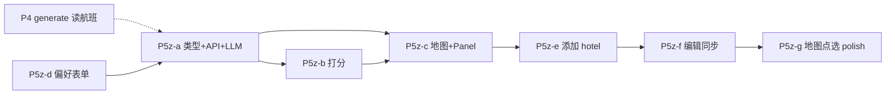

# 阶段 B 住宿区域 — 实施计划与状态

← [返回索引](./README.md) · [12-住宿区域倒推方案](./12-阶段B住宿区域倒推方案.md) · [06-机酒确认流程](./06-机酒确认与行程生成流程方案.md) · [09-航班实施计划](./09-阶段B航班功能实施计划.md)

> **版本**：v1.2 · **日期**：2026-07-05  
> **用途**：P5z 实施前/后同步；因子见 [12 §2.4](./12-阶段B住宿区域倒推方案.md)；地图交互见 [12 §5.1](./12-阶段B住宿区域倒推方案.md)。  
> **实施状态（2026-07-05）**：P5z-a～g **已交付**；**P5z-b 确定性打分已接入**（hub 排序 + 动态半径 + 分段提示）；P5b OTA **暂停**。

---

## 1. 功能清单与状态

| # | 功能 | 状态 | 说明 |
|---|------|------|------|
| 1 | 住宿段切分（城市/航班/日期） | ✅ | `segment.py` + `test_stay_zone_segment.py` |
| 2 | 片区推荐 API（LLM） | ✅ | `POST /stay-zones/recommend` |
| 3 | 因子 A～D 默认权重 | ✅ | `prompt.py` + rationale |
| 4 | 因子 E～S 扩展（rationale） | ✅ | Prompt 要求 rationale 点名 |
| 5 | 确定性 hub 打分（P5z-b） | ✅ | `score.py`：hub 排序、动态 radius、分段 warning |
| 6 | `RecommendedStayZone` 持久化 | ✅ | `travelIntel.ts` + `stayZone.ts` |
| 7 | 地图 polygon/circle 层 | ✅ | `TravelMap` + `stayZoneGeoJSON.ts` |
| 8 | 片区卡片 + 确认态 badge | ✅ | `StayZonePanel` + `leftPanelMode: stay` |
| 9 | 添加 hotel 到 itinerary | ✅ | `hotelNodeMutations.ts` · 每 segment 1 节点 |
| 10 | intel ↔ 节点双向同步 | ✅ | `hotelIntelSync.ts` + `updateNode` / `removeNode` |
| 11 | geocode 失败 → 地图点选 | ✅ | 复用 `startMapPick` |
| 12 | 偏好表单 | ✅ | `StayZonePreferenceForm`（首版：少换酒店 / 安全敏感） |
| 13 | Trip.com 片区 deep link | ✅ | `tripcom_deeplink.py` + 卡片 CTA |
| 14 | OTA ranked（P5b） | ⏸ | 可选，非 P5z |

---

## 2. 架构总览

```
                    ┌─────────────────────────────────────┐
                    │           TravelPlan                 │
                    │  trip_request · travel_intel · itinerary│
                    └─────────────────────────────────────┘
                                      │
          ┌───────────────────────────┼───────────────────────────┐
          ▼                           ▼                           ▼
   travel_intel.flights      itinerary.days[]          travel_intel.stay_zones[]
   (时刻锚点)                 POI/region/geocode         (推荐+确认片区)
          │                           │                           │
          └───────────────┬───────────┴───────────┬───────────────┘
                          ▼                       ▼
              POST /stay-zones/recommend    TravelMap stay-zone 层
                          │                       │
                          ▼                       ▼
                   StayZonePanel            用户确认 → hotel 节点
                          │                       │
                          └───────────┬───────────┘
                                      ▼
                          travel_intel.hotels[]
                          itinerary hotel nodes
```

**原则**（与 [12](./12-阶段B住宿区域倒推方案.md) 一致）：

1. **先 C1 完善 itinerary，再 B2 推荐片区**（质量最高；粗推允许无 itinerary）。  
2. **片区 ≠ 具体酒店**；酒店 = itinerary 节点 + intel 快照。  
3. **Phase 1 无 OTA**；Trip.com 仅 deep link。  
4. **搜不到地址 → 地图点选** 必保。

---

## 3. 推荐算法实现（分两轨）

### 3.1 轨道 1 — LLM（P5z-a，先交付）

**输入**：`TripRequest` + `flights[]` + `itinerary`（compact JSON）+ `StayZonePreferences?`

**步骤**：

1. **后端** `segment_stays()`：按城市、intercity 航班、`date_start/end` 切 `StaySegment[]`。  
2. **LLM** 每段输出 1～2 个 `RecommendedStayZone`（含 `label`、`rationale`、`anchor_hints`、`covers_day_indices`、策略 ①/②/③）。  
3. Prompt 显式要求考虑 [12 §2.4.2 A～D](./12-阶段B住宿区域倒推方案.md) + 在 rationale 中点名适用的 [§2.4.6 E～S](./12-阶段B住宿区域倒推方案.md)。  
4. **Geocode** `anchor_hints[0]` → `geometry.circle`（半径默认 800m，可调）。  
5. 写入 `travel_intel.recommended_stay_zones`（或 `last_stay_zone_session`）。

**Itinerary 压缩**（控制 token）：

- 每 day：`day_index`, `date`, `region`, `nodes: [{name, category, region, start_time, end_time, lat, lng}]`  
- 省略 tips/cost；无 geocode 的 lat/lng 省略

### 3.2 轨道 2 — 确定性打分（P5z-b，增强）

**文件**：`backend/app/services/stay_zone/score.py`

```python
def score_hub(hub, segment, itinerary, flights, prefs) -> float:
    # w_act  : sum_d distance(hub, weighted_centroid(day_d))
    # w_trn  : transit_access(hub)  # Phase 1: 常数或 LLM hub 名
    # w_flt  : airport_penalty first/last day
    # w_pref : preference_match
```

- `weighted_centroid(day)`：节点权重 = `duration(end-start)` 或 `1`；`airport/transit` × 0.3  
- 与 LLM 结果 **融合**：LLM 给候选 hub 名 → geocode → 用 score 排序 → 取 top1～2  
- 触发 **② 分段**：相邻 day centroid 距离 > `SPLIT_THRESHOLD_KM`（如 8km）且 transit > 45min 估算

### 3.3 分段规则（`segment.py`）

| 规则 | 动作 |
|------|------|
| `flights` 含新 city（intercity） | 新 segment |
| `trip_request.date` 连续且同 destination | 单 segment（可再拆） |
| 用户 `minimize_hotel_moves=false` 且 P>阈值 | 建议 2 zone |

---

## 4. 数据模型（前端 + 后端）

### 4.1 类型扩展 — `frontend/src/types/travelIntel.ts`

```typescript
interface RecommendedStayZone { /* 见 12 §4 */ }
interface StayZonePreferences { /* 见 12 §2.4.6 */ }

interface TravelIntel {
  // ...
  recommended_stay_zones?: RecommendedStayZone[];
  stay_zone_preferences?: StayZonePreferences;
  hotels: ConfirmedHotelStay[];
}

interface ConfirmedHotelStay {
  zone_id?: string;
  itinerary_node_id?: string;
  lat?: number;
  lng?: number;
  // ...
}
```

### 4.2 后端 Schema — `backend/app/schemas/stay_zone.py`

- `StayZoneRecommendRequest` / `StayZoneRecommendResponse`  
- Pydantic  mirror 前端类型；`geometry` 用 discriminated union

### 4.3 Store actions — `usePlanStore.ts`

| Action | 说明 |
|--------|------|
| `recommendStayZones()` | 调 API → 写 `recommended_stay_zones` |
| `confirmStayZone(id)` | `status=confirmed`；可选切地图视图 |
| `rejectStayZone(id)` | 用户 dismiss |
| `addHotelFromZone(zoneId, opts)` | 插入 itinerary hotel 节点 + `hotels[]` |
| `syncHotelFromNode(nodeId)` | 节点编辑后回写 intel |
| `removeHotelStay(id)` | 删 intel + 可选删节点 |
| `setStayZonePreferences(prefs)` | 表单 |

扩展 `syncTravelIntelStatus`：机+酒并重（[12 §2.4](./12-阶段B住宿区域倒推方案.md) 表）。

---

## 5. 前端 UI 实现

### 5.1 布局

| 方案 | 说明 | 推荐 |
|------|------|------|
| `leftPanelMode: 'stay'` | 对称 flight 全高 Panel | 可选 |
| **form + 地图分屏** | 左侧 `StayZonePanel`，右侧地图高亮 | **P5z-c 推荐** |
| 嵌入 `ItineraryEditor` 顶栏 | 「住宿片区」入口 | 与 form 并存 |

**入口**：

- 航班确认完成 CTA：「生成玩法并推荐住宿片区」  
- 有 itinerary 时 Preview 地图 toolbar：「推荐住宿区域」  
- Chat strip：「住宿片区」（`phase !== detailed` 或 supplement）

### 5.2 组件

| 组件 | 路径 | 职责 |
|------|------|------|
| `StayZonePanel` | `components/stay/StayZonePanel.tsx` | 卡片列表、rationale、确认/拒绝、Trip CTA |
| `StayZoneCard` | 同上 | 单段 zone + 覆盖 Day 标签 |
| `StayZonePreferenceForm` | `StayZonePreferenceForm.tsx` | 公共交通默认开；V2 扩展 E～S |
| `AddHotelFromZoneDialog` | 或内嵌 Panel | geocode 搜店 / 地图点选 |
| 地图层 | `TravelMap.tsx` | `stay-zone-fill` / `stay-zone-line` GeoJSON source |

### 5.3 地图层（MapLibre）

```typescript
// TravelMap: useEffect when recommended_stay_zones change
map.addSource('stay-zones', { type: 'geojson', data: zonesToGeoJSON(zones) });
map.addLayer({ id: 'stay-zone-fill', type: 'fill', paint: { 'fill-opacity': 0.15 } });
map.addLayer({ id: 'stay-zone-line', type: 'line' });
```

- 选中 zone：`filter` 或 `feature-state` 高亮  
- pick 模式与 zone 层 **pointer-events: none** on fill，不挡选点

### 5.4 添加 hotel 节点

**文件**：`frontend/src/utils/hotelNodeMutations.ts`（新建）

1. 找 segment 覆盖的 days  
2. 默认：在 **每日末节点后** 或 **仅 cross_day 前** 插入 `category: 'hotel'`（产品定：**首版 = 每天末 1 个 hotel 可选简化：仅 1 个 overnight hotel + cross_day**）  
3. `buildNodeCoordsPatch` 来自 geocode 或 map pick  
4. `ConfirmedHotelStay` 绑定 `itinerary_node_id`  
5. toast + 可选 `leftPanelMode: 'form'`

**首版简化（推荐）**：每 segment **1 个 hotel 节点**，连首尾 day 的 cross_day；多 day 覆盖用 `check_in/out` 表达。

### 5.5 编辑与同步

- 改 `node.name/lat/lng` → `usePlanStore` 订阅或 `updateNode` 后调 `syncHotelFromNode`  
- 删节点 → `removeHotelStay` 对称 [航班 remove 同步](../09-阶段B航班功能实施计划.md)

### 5.6 Badge 三态

```typescript
getStayZonePanelPhase(intel): 'idle' | 'pending' | 'done'
// done: 有 confirmed zone 或 hotels with coords
// pending: 有 proposed zones
// idle: 无
```

---

## 6. 后端实现

| 文件 | 职责 |
|------|------|
| `backend/app/api/v1/stay_zones.py` | `POST /recommend` |
| `backend/app/schemas/stay_zone.py` | Request/Response |
| `backend/app/services/stay_zone/segment.py` | 住宿段切分 |
| `backend/app/services/stay_zone/recommend.py` | LLM 调用 + geocode geometry |
| `backend/app/services/stay_zone/score.py` | P5z-b 确定性打分 |
| `backend/app/services/stay_zone/prompt.py` | System prompt（因子 A～S 摘要） |
| `backend/scripts/test_stay_zone_segment.py` | 分段单测 |

**LLM Prompt 要点**：

- 输入 compact itinerary + flights + preferences  
- 输出 JSON `{ zones: [...] }` 仅 JSON  
- 每 zone 必含 `rationale`（中文，含 trade-off）  
- 多候选时说明策略 ① 或 ②

**Geocode**：复用 `geocoding.py`；hub 失败则 zone 无 geometry，仅文本卡片。

---

## 7. 迭代顺序与依赖



| 迭代 | 交付 | 可验收 | 状态 |
|------|------|--------|------|
| **P5z-a** | 类型、API、LLM recommend、Panel 卡片 | 有 itinerary 时出现 zone + rationale | ✅ |
| **P5z-b** | segment + score + geocode circle | 地图可见圆（无 hotel 节点） | ✅ |
| **P5z-c** | TravelMap 层 + 确认态 + Trip link | 地图+卡片联动 | ✅ |
| **P5z-d** | `StayZonePreferenceForm` → API | 改偏好后重新 recommend | ✅ 首版 |
| **P5z-e** | add hotel 节点 + intel | 路线图出现 hotel | ✅ |
| **P5z-f** | 编辑/删除同步 | hotel 节点 ↔ intel | ✅ |
| **P5z-g** | map pick 兜底 | geocode 失败可点选 | ✅ |

**依赖 P4 否？** P5z **不阻塞** P4；无航班时仍可 recommend（C 因子减弱）。P4 完成后 generate 可读 `confirmed zone`（P5z 后续补丁）。

---

## 8. 文件索引（计划新增/修改）

| 用途 | 路径 |
|------|------|
| 方案与因子 | [12-阶段B住宿区域倒推方案.md](./12-阶段B住宿区域倒推方案.md) |
| 类型 | `frontend/src/types/travelIntel.ts`、`types/stayZone.ts`（可选拆分） |
| API 客户端 | `frontend/src/api/stayZones.ts` |
| Store | `frontend/src/stores/usePlanStore.ts` |
| UI | `frontend/src/components/stay/StayZonePanel.tsx` 等 |
| 地图 | `frontend/src/components/map/TravelMap.tsx`、`utils/stayZoneGeoJSON.ts` |
| 节点变更 | `frontend/src/utils/hotelNodeMutations.ts` |
| 入口 | `InputPanel.tsx`、`PreviewPane.tsx`（地图 toolbar `StayZoneToolbarButton`） |
| 后端路由 | `backend/app/api/v1/stay_zones.py` |
| 后端服务 | `backend/app/services/stay_zone/*` |
| 单测 | `backend/scripts/test_stay_zone_segment.py`、`test_stay_zone_score.py` |

---

## 9. 验证

```bash
# 后端分段 + 打分单测
cd backend && PYTHONPATH=. python scripts/test_stay_zone_segment.py
cd backend && PYTHONPATH=. python scripts/test_stay_zone_score.py

# 前端构建
cd frontend && npm run build
```

**手动 UI 路径**：

1. 确认航班 → generate → 微调节点/region  
2. 打开「住宿片区」→ 见卡片 rationale（含 Day 覆盖与 trade-off）  
3. 地图见色块 → 确认片区  
4. 「添加酒店」→ geocode 或地图点选  
5. 编辑 hotel 节点 → intel 同步；删除 → 片区/ intel 清理  

---

## 10. 风险与首版简化

| 项 | 首版决策 |
|----|----------|
| 每天一个 hotel vs 每 segment 一个 | **每 segment 1  hotel 节点** |
| polygon vs circle | **circle**（hub geocode + 800m） |
| LLM vs 纯算法 | **LLM 先**，score 后增强 |
| leftPanelMode `stay` | **可选**；优先 form+地图 |
| 因子 E～S | **先进 rationale**；表单 V2 再打分 |

---

## 11. 与 09 航班计划对照

| 航班 P3 | 住宿 P5z |
|---------|----------|
| Ignav ranked | LLM zone + geocode circle |
| `FlightIntelPanel` | `StayZonePanel` + 地图 |
| `confirmFlightQuote` | `confirmStayZone` + `addHotelFromZone` |
| `FlightManualAddPanel` | geocode + **map pick** |
| `leftPanelMode: flight` | form+地图 或 `stay` |
| stale search | recommend 可重新触发；保留旧 zone 直到新版返回 |

---

*文档版本：v1.2 · 2026-07-05 · P5z 全量交付（P5b OTA 待选）*

> **待办追踪**：[TODO.md](./TODO.md) · 开放项 **B-P5b-01**（⏸）· **B-P4-02**（generate 读片区）
