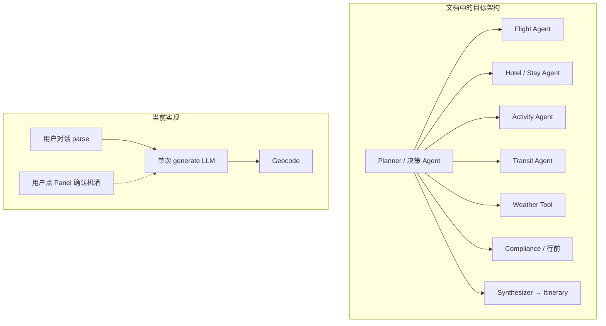
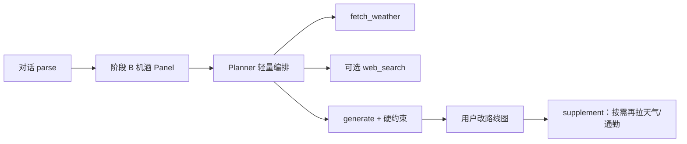

# 天气 / 联网 / 旅游决策 Agent — 缺口分析与数据源矩阵

← [返回索引](./README.md) · [00-概述与架构](./00-概述与架构.md) · [总索引 TODO](../TODO.md) · [本域 TODO](./TODO.md)

> **分析日期**：2026-08-06 · **版本**：v1.2  
> **结论（历史）**：四块曾缺口明显。**v1.2 更新**：`WX-01` 和风每日预报已接入 generate（soft-fail）；Tavily authority soft-merge / Evidence 已部分落地；完整 Planner / Chat `fetch_weather`（WX-03）仍开放。  
> **优先级纠偏（必读）**：见 **[16](./16-产品能力优先级纠偏分析.md)**。

---

## 0. 总览：设计 vs 现状

| 能力 | 设计文档位置 | 代码现状 | 缺口级别 |
|------|--------------|----------|----------|
| **天气查询** | [总览路线图 §7.3](../总览路线图实现分析.md)、`weather_tool.py` | **WX-01 ✅** generate 前拉预报写入 `days[].weather`；对话 `fetch_weather`（WX-03）未接通 | **中**（对话 UI） |
| **联网查询** | [项目分析 §7](../项目分析与设计文档.md)、[00 §3](./00-概述与架构.md) | **Tavily Key 已入 `.env`，未接线**；无 tool loop | **高** |
| **旅游决策 Agent** | [00 §2–3 Planner 多 Agent](./00-概述与架构.md) | 单次 `chat/parse` + 单次 `itineraries/generate`；阶段 B 机酒为 **人机 Panel**，非 Agent 编排 | **高** |
| **按决策选数据源** | 各专题 01～05 分散 | 航班 Ignav ✅、住宿 P5z ✅、其余专题多为文档；**无「决策树 → Tool → Provider」统一表** | **中高** |



---

## 1. 天气查询

### 1.1 已有

| 层 | 状态 |
|----|------|
| `DayPlan.weather` Schema | ✅ `temp_min/max`、`icon`、`description`、`source` |
| UI 手动编辑 | ✅ `DayWeatherEditor` |
| generate 时 LLM 填天气 | ✅ `itinerary_llm.py`，`source: llm` |
| 总览列头展示 | ✅ |
| `weather_tool.py` stub | ✅ 仅文档字符串 + 占位返回 |

### 1.2 缺失

| 项 | 说明 |
|----|------|
| **和风天气 API 调用** | 凭据已入 `.env`（`QWEATHER_*`），**业务代码未接** |
| Chat `action: fetch_weather` | parse 未注册可执行；无 Patch 确认卡 |
| 雨天备选 / rain plan | [05-行前](./05-行前细节清单.md) 提到联动，未做 |
| 住宿因子 M（天气） | [12 §2.4.6](./12-阶段B住宿区域倒推方案.md) 进 rationale 文本即可，**打分未读 API 天气** |

### 1.3 选定数据源：和风天气（QWeather）

> 官方文档：[https://dev.qweather.com/docs/](https://dev.qweather.com/docs/)  
> 配置变量（根目录 `.env`，模板见 `.env.example`）：`QWEATHER_CREDENTIAL_ID` · `QWEATHER_API_KEY` · `QWEATHER_API_HOST`

| 项 | 取值 / 说明 |
|----|-------------|
| **Provider** | 和风天气开发者服务 |
| **凭据** | 控制台「项目 → 凭据」；**Credential ID** 与 **API KEY** 分离；请求用 Key（或 JWT） |
| **Host** | **控制台 → 设置** 专属 Host（`https://xxxx.yy.qweatherapi.com`）；共享 `devapi`/`api.qweather.com` 已淘汰（403 Invalid Host） |
| **认证** | Phase 1：**API KEY**（推荐 Header `X-QW-Api-Key`，见[身份认证](https://dev.qweather.com/docs/configuration/authentication/)）；长期建议 **JWT**（2027-01 起 API KEY 将限流） |
| **本项目必用接口** | ① [GeoAPI 城市搜索](https://dev.qweather.com/docs/api/geoapi/) → `Location ID`；② [每日天气预报](https://dev.qweather.com/docs/api/weather/weather-daily-forecast/)（3d/7d/10d/30d 按行程跨度选） |
| **可选增强** | 天气指数（穿衣/紫外线）、预警、分钟降水（中国）→ tips / rain_plan |
| **Fallback** | Open-Meteo（免 Key）→ LLM `source:llm` |

**调用链（WX-01）**：

```
destination + date
  → GET /geo/v2/city/lookup?location={destination}
  → locationId
  → GET /v7/weather/{3d|7d|10d}?location={locationId}
  → 按 date 匹配 daily[] → DayWeather { temp_min, temp_max, icon, description, source: api }
```

**和风 `icon` / 天气现象 → 本项目 `weather.icon`（建议）**：

| 和风现象（摘要） | `weather.icon` |
|------------------|----------------|
| 晴、热 | `sunny` |
| 多云、少云 | `cloudy` |
| 阴、雾、霾 | `overcast` |
| 雨、阵雨、毛毛雨 | `rain` |
| 雷阵雨、强对流 | `storm` |
| 雪、雨夹雪 | `snow` |

完整码表见官方[天气现象](https://dev.qweather.com/docs/resource/icons/)。实现时以 `text`/`icon` 字段映射，未知 → `cloudy`。

| 备选 Provider | 用途 | 优先级 |
|---------------|------|--------|
| Open-Meteo | 和风失败 / 境外兜底 | P1 |
| LLM 推断 | 双 API 失败 | 已有 |

### 1.4 待办 ID

→ [TODO.md](./TODO.md) `WX-01`～`WX-04`（**WX-01 = 和风接入**）· [TODO-路线图](../TODO-路线图与总览.md) `OV-04` 并入对话 UI。

---

## 2. 联网查询（web_search）

### 2.1 设计意图（未落地）

[项目分析 §7.1](../项目分析与设计文档.md) 规划两种路径：

| 方案 | 机制 | 现状 |
|------|------|------|
| A. DeepSeek 原生 `web_search`（Anthropic 兼容端点） | Server-side tool | **未接**（备选） |
| B. **Tavily**（本项目主选） | REST + 可选 MCP | **Key 已入 `.env`，代码未接** |

当前 `LLMClient` 为 OpenAI 兼容 JSON chat，**无 tool loop、无联网挂载**。坐标主路径已用 Geocoding（正确），但 **攻略事实、开放时间、临时闭园、签证规则变更** 仍靠模型参数记忆 → 易幻觉。

### 2.2 该搜什么 / 不该搜什么

| 决策场景 | 是否联网 | 原因 |
|----------|----------|------|
| POI 攻略、tips、开放时间 | ✅ 宜联网或 KB | 事实易变 |
| 票价 / 酒店价 | ❌ 禁止纯联网摘价 | 用 Ignav / deep link / OTA API |
| 坐标 | ❌ 不以搜索摘要为主 | Geocoding API |
| 签证/入境规则 | ✅ 宜官方页 + KB，联网核验 | [05](./05-行前细节清单.md) |
| 天气 | ❌ 不走通用搜索 | **和风天气** |
| 地铁耗时 | ⚠️ 宜 Directions/GTFS；搜索仅补漏 | [04](./04-通勤与交通卡.md) |

### 2.3 选定数据源：Tavily

> 文档：[https://docs.tavily.com/](https://docs.tavily.com/) · Agents：[https://docs.tavily.com/agents.md](https://docs.tavily.com/agents.md)  
> 配置：`TAVILY_API_KEY` · 可选 `TAVILY_MCP_URL` · `TAVILY_SEARCH_DEPTH` · `TAVILY_MAX_RESULTS`

| 用途 | 方式 | 说明 |
|------|------|------|
| **后端运行时**（WS-01） | REST `POST https://api.tavily.com/search` 或官方 SDK `tavily` / `@tavily/core` | `Authorization: Bearer $TAVILY_API_KEY` |
| **Cursor 编码 Agent** | Remote MCP | `npx -y mcp-remote` + `TAVILY_MCP_URL`；工具名 `tavily_*`（search / extract / crawl / map） |
| **CLI** | `tvly` | 本地联调；不进生产路径 |
| **Skills** | `npx skills add tavily-ai/skills --all` | 编码侧最佳实践，非 App 依赖 |

**后端最小封装（WS-01）**：

```python
# 伪代码 — app/services/web_search/tavily.py
POST /search
{
  "query": "...",
  "search_depth": settings.tavily_search_depth,  # basic | advanced
  "max_results": settings.tavily_max_results,
  "include_answer": true
}
→ { results: [{ title, url, content }], answer? }
→ provenance: { source: "api", url, fetched_at, confidence: "medium" }
```

**MCP（仅开发者本机 Cursor，勿把带 Key 的 URL 写进仓库文档）**：

```json
{
  "mcpServers": {
    "tavily": {
      "command": "npx",
      "args": ["-y", "mcp-remote", "${TAVILY_MCP_URL}"]
    }
  }
}
```

联调自检（Key 来自 `.env`，勿贴进 commit）：

```bash
curl -s https://api.tavily.com/search \
  -H "Authorization: Bearer $TAVILY_API_KEY" \
  -H "Content-Type: application/json" \
  -d '{"query":"Singapore MRT tourist pass 2026"}'
```

### 2.4 推荐接入顺序

1. **Phase WS-a**：后端 `TavilyClient.search` + Planner/generate 注入 tips（有限轮）  
2. **Phase WS-b**：对话 Tool `web_search` + Patch 确认（可选展示摘要 URL）  
3. DeepSeek 原生联网仅作 Tavily 不可用时的 fallback  

### 2.5 待办 ID

→ `WS-01`～`WS-03`（**WS-01 = Tavily REST 接入**）

---

## 3. 旅游决策 Agent（Planner）

### 3.1 文档中的 Agent 分层（[00 §3.1](./00-概述与架构.md)）

| Agent | 职责 | 落地？ |
|-------|------|--------|
| **Planner** | 意图路由、预算校验、任务 DAG | ❌ |
| Flight | `search_flights` | ⚠️ 人点 Panel + Ignav，非 Agent Tool |
| Hotel / Stay | 片区 / 酒店 | ⚠️ P5z 人点 Panel |
| Activity | 游玩品类与票务 | ❌ |
| Transit | 边耗时 / 交通卡 | ❌ |
| Compliance | 签证 / 假期 | ❌ |
| Weather | `fetch_weather` | ❌ stub |
| Synthesizer | 组装 Itinerary | ⚠️ 单次 LLM generate |

### 3.2 当前「决策」实际发生在哪

| 决策点 | 谁决策 | 问题 |
|--------|--------|------|
| 目的地 / 天数 / 偏好 | 用户 + parse FormPatch | ✅ 够用 |
| 是否搜航班 / 确认航段 | 用户点 UI | ✅ 阶段 B 有意为之 |
| 住哪片区 | 用户确认 LLM/score 推荐 | ✅ P5z |
| 每天玩什么、顺序、备选 | **单次 generate LLM** | ❌ 无工具增强、无天气/通勤约束闭环 |
| 雨天是否改室内 | 无 | ❌ |
| 预算超支是否降级景点 | 无结构化校验 | ❌ |

### 3.3 建议的最小可行 Planner（不必一次上满 LangGraph）

**Phase AG-1（规则 + 显式 Tool 编排，推荐先做）**

```
输入: TripRequest + travel_intel + （可选）对话意图
  1. Planner 规则表决定「本轮需要哪些 Tool」
  2. 并行: fetch_weather |（可选）web_search tips |（已有）flights/stay 只读
  3. 将 Tool 结果注入 generate Prompt（硬约束）
  4. Synthesizer = 现有 itinerary_llm + geocode
```

**Phase AG-2（对话内 Agent）**

- parse 可发出 `fetch_weather` / `search_flights` / `web_search`  
- 用户确认 Patch 后写回  

**Phase AG-3（完整 DAG）**

- LangGraph / 自研状态机：Flight → Stay → Activity → Transit → Weather → Synthesize  

与产品决策对齐：**机酒确认仍可人机 Panel**；Agent 负责 **「已确认锚点之后」的玩法编排与事实补全**，避免与阶段 B UX 冲突。

### 3.4 待办 ID

→ `AG-01`～`AG-04`

---

## 4. 决策 → 数据源获取矩阵（补充核心）

> 决策 Agent 判断「需要什么信息」后，按下表选择获取方式。  
> **原则**：可验证数字走 API/KB；LLM 只做编排与文案；禁止联网编票价。

### 4.1 矩阵

| 决策问题 | Agent / 步骤 | 首选数据源 | Fallback | 写入位置 | 现状 |
|----------|--------------|------------|----------|----------|------|
| 飞哪班 / 何时到 | Flight / 用户 Panel | **Ignav** | LetsFG；手动腿 | `travel_intel.flights[]` | ✅ Panel |
| 住哪片区 | Stay | LLM+score + Geocode circle | 粗推无 itinerary | `recommended_stay_zones` | ✅ P5z |
| 订哪家酒店价 | Hotel OTA | Partner API | Trip deep link | `hotels[]` / 节点 | ⏸ P5b |
| 今天室外还是室内？ | Weather | **和风天气**（QWeather） | LLM | `days[].weather` | ✅ WX-01（Chat UI 仍缺） |
| 景点是否开放 / 需预约 | Activity | Places / 官方 / **Tavily** | KB YAML | `activity_detail` / tips | ⚠️ Places hours soft（WS-08b） |
| A→B 几分钟？ | Transit | OSRM / Directions / LTA | LLM 估 + warning | `edges.duration_minutes` | ✅ **TRN-01** 按需 + **TRN-02** 可疑边自动补算（非全量） |
| 要不要办交通卡？ | Compliance/Transit | **目的地 YAML KB** | web_search 核验 | `meta.transit_cards[]` | ❌ 文档 |
| 签证 / 入境 | Compliance | KB + 官方 URL | web_search | `pre_trip_checklist[]` | ❌ |
| POI 坐标 | resolve_place | **Geocode** | Wikidata；地图点选 | `nodes.lat/lng` | ✅ |
| 行程骨架 / 文案 | Synthesizer | LLM + 上述注入 | Mock | `Itinerary` | ✅ 弱约束 |

### 4.2 决策规则草图（Planner 可用）

```text
IF date_start..date_end 在预报窗口内:
  MUST fetch_weather(all days) before outdoor-heavy generate
IF travel_intel.flights confirmed:
  HARD constrain Day1 arrive / last Day depart
IF recommended_stay_zones confirmed OR hotels with coords:
  BIAS nodes.region toward zone label
IF weather.icon in {rain, storm} for day d:
  PREFER indoor attractions; ADD tip rain_plan
IF destination in knowledge_base:
  INJECT transit_card + visa checklist stubs
IF user asks "查天气/开放时间/签证":
  ROUTE to fetch_weather | web_search | compliance tool
NEVER invent flight/hotel price from web_search snippets
```

### 4.3 与现有阶段 B 流程的衔接



- **不把** Ignav/住宿 Panel 改成纯 Agent 自动确认（产品已选人机确认）。  
- **把** generate 前后的事实层交给 Planner + Tools。

---

## 5. 实施分期建议

| 分期 | 交付 | 依赖 | 优先级 |
|------|------|------|--------|
| **WX-a** | 和风 Geo + 每日预报写入 `days[].weather` `source:api`；generate 前可批量拉 | `QWEATHER_API_KEY` | **P0** |
| **WX-b** | Chat `fetch_weather` + Patch 确认 UI | WX-a、ai-chat-ui | P1 |
| **WS-a** | Tavily `search` Tool + 有限轮注入 tips/开放时间 | `TAVILY_API_KEY` | P1 |
| **AG-1** | 规则 Planner：决定是否拉天气/注入 intel 再 generate | WX-a、B-P4 | **P0** |
| **AG-2** | 对话路由到 tools | WS-a、WX-b | P2 |
| **AG-3** | Activity/Transit/Compliance Agents + KB | 04/05 YAML | P2–P3 |

与机酒主链关系：`B-P4-01`（generate 读 flights）应与 **AG-1 同批**，同属「生成前注入真实锚点」。

---

## 6. 文件索引（计划新增）

| 路径 | 职责 |
|------|------|
| `backend/app/services/weather/qweather.py` | Geo lookup + 每日预报 + icon 映射 |
| `backend/app/services/weather/open_meteo.py` | 和风失败时的免 Key 兜底（可选） |
| `backend/app/services/weather_tool.py` | stub → 调和风 |
| `backend/app/services/web_search/tavily.py` | Tavily search / extract 封装 |
| `backend/app/services/planner/` | 规则编排：tools 选择 + prompt 注入 |
| `backend/app/data/kb/{sg,jp,th}/` | 交通卡 / 签证 stub YAML |
| 根目录 `.env` | `QWEATHER_*` · `TAVILY_*`（已模板化，勿提交 Key） |
| Cursor MCP | 本机 `tavily` Remote MCP（开发用，非 App 运行时） |
| Chat parse + Patch UI | `fetch_weather` / search 确认卡 |

---

## 7. 结论（直接回答）

| 问题 | 答案 |
|------|------|
| 是否还缺天气查询？ | **是** — 仅有 LLM 推断与 stub；**和风 Key 已配置，待 WX-01 接线** |
| 是否还缺联网查询？ | **是** — **Tavily Key 已配置，待 WS-01 接线**；MCP 仅服务编码 Agent |
| 是否还缺旅游决策 Agent？ | **是** — 文档有 Planner 分层，实现仍是「人点 Panel + 单次 generate」 |
| 是否缺「按决策选数据源」？ | **是（已在本文 §4 补矩阵）** — 天气=和风、联网=Tavily、票价≠搜索 |

**下一步建议**：先做 **WX-01（和风）+ AG-01 + B-P4**，再 **WS-01（Tavily REST）**，最后 Activity/Transit Agents。

---

## 8. 安全说明

- **真实 API Key 只放根目录 `.env`**（已 gitignore），**禁止**写入 Markdown / 提交仓库。  
- 本对话中曾粘贴明文 Key；若仓库或聊天会外传，请在和风 / Tavily 控制台**轮换密钥**。  
- Tavily MCP URL 含 Key，仅本机 Cursor 配置；勿提交到 git。

---

*文档版本：v1.1 · 2026-08-06 · 待办见 [TODO.md](./TODO.md) `WX-*` / `WS-*` / `AG-*`*
