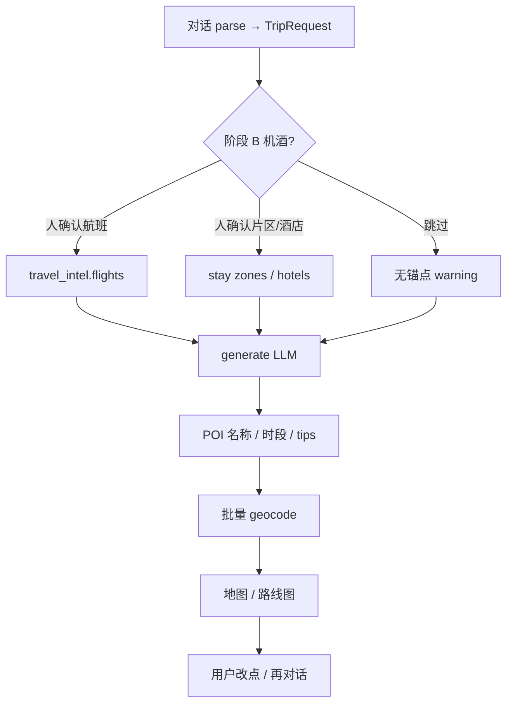

# 产品能力优先级纠偏 — 整体批判分析

← [返回索引](./README.md) · [15-天气联网Agent](./15-天气联网与决策Agent缺口分析.md) · [TODO](./TODO.md) · [06-机酒流程](./06-机酒确认与行程生成流程方案.md)

> **日期**：2026-08-06 · **版本**：v1.0  
> **缘起**：用户指出 [15](./15-天气联网与决策Agent缺口分析.md) 等文档「按要求列点」，**未论证是否需要**、**未指出真正缺口**、**未说明拿到信息后如何得到合理行程**；并强调 **机酒不准、地址搜索完全不起作用**。  
> **本文立场**：先修「行程可落地」的因果链，再谈天气 / Tavily / 决策 Agent。

---

## 0. 对前序分析的自我纠偏

| 前序做法 | 问题 |
|----------|------|
| 用户问「缺不缺天气/联网/Agent」→ 直接列缺口矩阵并接 Key | **默认「缺 = 要做」**，未问「不做会不会阻塞主价值」 |
| 补和风 / Tavily / Planner 分期 | 像能力扩张清单，**不是产品诊断** |
| 决策→数据源表 | 漂亮，但 **上游坐标与机酒锚点若错，下游再聪明也白搭** |

**正确顺序应是**：

```text
用户意图是否被听懂？
  → 机酒锚点是否可信？（时刻 / 机场 / 入住片区）
    → POI 名称与坐标是否在真实地图上？
      → 日程是否可走通（通勤、开闭园、天气仅加成）？
        → 文案/tips 是否诚实标注来源？
```

天气、通用联网、完整 Planner **处在偏下游或横切**；当前主诉「机酒不准 + 地址废了」属于 **链条中段断裂**，应优先于 WX/WS/AG 大上线。

---

## 1. 产品真正在卖什么？

文档定位（[README](./README.md)）已写清：

> 先做 **智能行程规划**（POI、动线、时间、注意事项），**不做订票平台**。

因此「准确」应分层，**禁止用一套标准衡量所有字段**：

| 层级 | 用户期望的「准」 | 当前可达 | 评价 |
|------|------------------|----------|------|
| **L0 可规划** | 目的地、天数、偏好被记下 | parse + TripRequest ✅ | 够用 |
| **L1 可落地地图** | 点在对的城市、大致对的区域 | Geocode + 地图点选 | **主诉失效 → 最高优先级** |
| **L2 可衔接机酒** | 抵达/离开时刻、机场、住哪一带不离谱 | Ignav Panel + P5z 片区；**generate 未吃 intel（B-P4）** | **结构性不准** |
| **L3 可参考报价** | 票价/房价接近可订 | Ignav 参考价 / Trip deep link；酒店无 OTA | 诚实边界内可接受 |
| **L4 可替代订票** | 一键出票 | ❌ 明确不做 | 不应投入 |

**问题 1（请确认）**：你们对外承诺的「准」，是 L1+L2，还是用户以为在买 L3/L4？若营销话术像订票助手，会与架构永久冲突。

---

## 2. 端到端因果链（现状 vs 合理结果）



| 环节 | 现状 | 对「合理旅行结果」的影响 |
|------|------|--------------------------|
| parse | 有 | 意图丢了则全盘错 |
| 航班确认 | Panel + Ignav ✅ | 人选定后应成为 **硬约束** |
| generate 读 flights | **未接（B-P4）** | LLM 仍可能编机场时刻 → **即使用户已选对航班，行程仍可能不准** |
| 行程日期对齐 | `_llm_to_itinerary` 有用「今天」而非 `trip_request.date_start` 的风险 | **日历与航班日错位**（实现缺口，随 B-P4 一并修） |
| 住宿 | P5z 片区 ✅；具体酒店弱 | 「住哪一带」可准；「哪家店多少钱」本就不应装准 |
| POI 生成 | 纯 LLM | 名称幻觉、同名异地 |
| **地址搜索 / geocode** | 有 API，但用户反馈 **完全不起作用** | **地图废 = 产品废**；一切后续 Agent 无意义 |
| 天气 / Tavily | Key 已配未接 | 改善 tips，**不修复错坐标/错航班锚点** |

**「拿到信息后如何分析得到合理结果」——应有的判定逻辑（当前几乎没有）**：

1. **锚点优先**：有 `flights[]` → Day1 抵达、末日离开不可违背；有 confirmed zone → 酒店/夜间节点落在圈内或说明 trade-off。  
2. **空间可行**：相邻节点 geocode 后直线/地铁时间超阈值 → 警告或重排（无 Directions 时至少距离启发式）。  
3. **事实降级**：无 API 的开放时间/票价 → `confidence: low` + deep link，禁止当事实展示。  
4. **冲突展示**：机酒与玩法冲突时，**显式让用户选**（改玩法 / 改机酒），而不是静默编一个「看起来完整」的 JSON。

今天缺的不是「更多数据源名词」，而是 **2～4 的裁决层**（轻量即可，不必先上完整 Planner）。

---

## 3. 机酒「不够准确」——拆开看

### 3.1 机票

| 不准的类型 | 原因 | 是不是加 Tavily/天气能好？ |
|------------|------|---------------------------|
| App 内报价与 Trip 最终价不一致 | Ignav ≠ 出票系统；行业常态 | 否；应用文案管理预期 |
| 中文地名 / 机场解析错 | 别名表不全、手动录入校验弱 | 否；要别名 + validate |
| **生成的行程无视已确认航班** | **B-P4 未做** | **否；这是主因之一** |
| 多城 intercity 弱 | P3 模板未做 | 否 |

### 3.2 酒店 / 住宿

| 不准的类型 | 原因 | 说明 |
|------------|------|------|
| 没有可订房价列表 | 产品已选 **片区倒推**，非 OTA ranked（P5b ⏸） | **不要用「搜酒店」标准衡量 P5z** |
| 片区圆心偏了 | hub geocode / LLM label 差 | **依赖同一套地址能力** |
| generate 酒店占位乱 | 未吃 confirmed zone（B-P4-02） | 与航班同构问题 |

**问题 2**：用户说的「酒店不准」，指的是：  
**(A)** 片区推荐不合理，**(B)** 没有具体酒店报价，**(C)** 路线图上的酒店点飞了，还是 **(D)** Trip 链接城/日期不对？  
四者对策完全不同；请标定主诉。

---

## 4. 地址搜索「完全不起作用」——优先诊断

代码路径是通的：`NodeCoordEditor` → `GET /api/v1/geocode/autocomplete` → Photon → Nominatim。  
「完全不起作用」更像是 **运行时/体验级故障**，而非「没设计」：

| 假设 | 如何验证 | 若成立怎么修 |
|------|----------|--------------|
| **H1** 前端打不到后端（`VITE_API_BASE` / 代理 / 后端未起） | 浏览器 Network 是否 404/Failed | 修代理与启动文档 |
| **H2** Photon/Nominatim 被墙或超时，双源失败 → 502 或空结果 | 后端日志 `GeocodeProviderError`；直连 photon/nominatim | 换国内可达源（含 **和风 GeoAPI** 作地理搜索，不仅天气）或自建缓存 |
| **H3** 中文 POI + 境外目的地变体差，**有响应但 0 条** | UI 提示「未找到」 | 查询策略、别名、Google/Mapbox |
| **H4** 批量 geocode 静默失败，地图空白，用户以为「搜索坏了」 | 节点无 lat/lng；meta.warnings | 失败可见化 + 强制点选引导 |
| **H5** autocomplete debounce / MIN_QUERY_LEN / destination 空 | 复现步骤 | 前端修复 |

**问题 3**：请补充一次复现：是 **节点编辑里搜地址**、**生成后地图没点**，还是 **住宿添加酒店 geocode**？有无报错文案？

**纠偏建议**：和风 Key 已有 → **地理能力应优先用于「地点解析」兜底**（GeoAPI），天气是第二优先级；否则「有天气 API、没坐标」本末倒置。

---

## 5. 天气 / Tavily / 决策 Agent —— 「要不要」重评

| 能力 | 不做的代价 | 现在做的代价 | 建议 |
|------|------------|--------------|------|
| **和风·预报** | 穿衣/雨天 tips 仍靠 LLM 猜 | 工期；与主诉无关 | **P2**：坐标稳定后再做；或仅作 generate 后装饰 |
| **和风·Geo** | 继续依赖易挂的 OSM Photon | 接入成本 | **可提前**：专治地址搜索 |
| **Tavily** | tips/开放时间易幻觉 | 成本、幻觉网页、乱价风险 | **P2**：且严格禁用于票价；先修坐标与 B-P4 |
| **完整 Planner Agent** | 编排不优雅 | 复杂度暴涨 | **暂缓**；用「生成前注入规则」代替（即瘦身 AG-01） |
| **B-P4 generate 吃 intel** | 机酒与行程两张皮 | 中等 | **P0** |
| **地址搜索可用性** | 产品不可用 | 诊断 + 可能换源 | **P0** |

[15](./15-天气联网与决策Agent缺口分析.md) 仍有参考价值（矩阵、Key 配置），但 **优先级应降级**；本文为纠偏主文档。

---

## 6. 「合理旅行结果」最小判决器（建议实现，而非大 Agent）

在 `generate` 前后增加 **可测试的检查**（比上 Planner 更值钱）：

```text
INPUT: TripRequest + travel_intel + itinerary(draft)
CHECKS:
  1. 若有 outbound 抵达时刻 → Day1 首个非 airport 活动不早于抵达+缓冲
  2. 若有 return 起飞 → 末日活动不晚于起飞-缓冲
  3. 若有 confirmed stay zone → 夜间 hotel 节点距 hub < R 或 warning
  4. 每个需上地图的节点：有坐标 或 标记 needs_map_pick
  5. 同日相邻 POI 若皆有坐标且距离 > 阈值 → warning「当天跨度过大」
OUTPUT: itinerary + meta.warnings[] + 可选 blocking_issues[]
```

数据不够时：**降级诚实**，而不是再调一个 LLM 把洞填上。

---

## 7. 建议重排后的优先级

| 序 | ID / 主题 | 理由 |
|----|-----------|------|
| 1 | **诊断并修复地址搜索（含批量 geocode 可见性）** | 用户主诉；无此无地图产品 |
| 2 | **B-P4-01/02** generate 硬吃 flights + stay | 机酒「不准」的结构性主因 |
| 3 | 和风 **GeoAPI** 作 geocode 兜底（若 OSM 不可达） | 复用已有 Key，对准主诉 |
| 4 | UX-14 无行程时折叠预览 | 体验，不堵主链 |
| 5 | 瘦身 AG-01 = 上面 §6 判决器 | 不是多 Agent 框架 |
| 6 | WX 预报 / Tavily tips | 锦上添花 |
| ⏸ | 完整决策 Agent、OTA 酒店搜价、Duffel | 等 L1+L2 稳了再谈 |

---

## 8. 需要你拍板的问题（请直接答）

1. **「准」的对外承诺**是 L1+L2，还是用户在要 L3 报价级准确？  
2. **酒店不准**具体是 A 片区 / B 无报价 / C 坐标飞 / D 链接错？  
3. **地址搜索挂了**的复现路径与报错原文？（Network 状态码最好）  
4. 境外目标城市是否常在 **Photon/Nominatim 不稳定** 的网络环境？若是，是否接受 **和风 Geo / 地图商** 作主地理源？  
5. 阶段 B 机酒：是否坚持「人确认后再生成」？若是，**未确认也允许 generate**（决策 B）是否仍要保留，还是改为强提示几乎强制确认？  
6. 天气与 Tavily：是否同意 **坐标 + B-P4 完成前不排期实现**，Key 仅作预留？

答完 1～3 后，应用 **诊断地址搜索** 或 **B-P4** 开干，而不是继续扩 Agent 文档。

---

## 9. 文档关系

| 文档 | 角色 |
|------|------|
| **本文** | 优先级纠偏、主诉诊断、待确认问题 |
| [15](./15-天气联网与决策Agent缺口分析.md) | 天气/联网/Agent 技术附录；**不再当作当前主路线** |
| [TODO](./TODO.md) | 应按本文 §7 重排（见同步提交） |

---

*文档版本：v1.0 · 2026-08-06*
