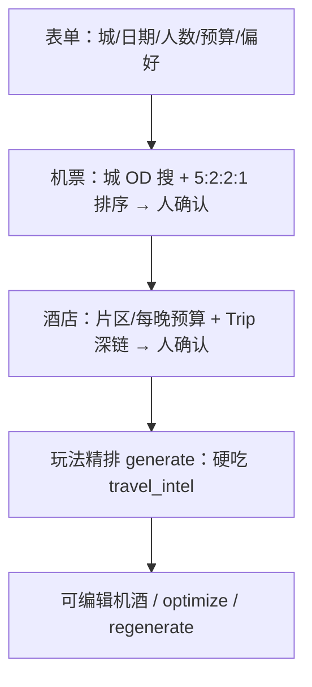

# 用户决策回应 + Geocode 根因 + 机酒性价比产品重排

← [16-纠偏](./16-产品能力优先级纠偏分析.md) · [02-酒店](./02-酒店信息.md) · [01-航班](./01-航班信息.md) · [TODO](./TODO.md)

> **日期**：2026-08-06 · **版本**：v1.0  
> **依据**：用户对 16 §8 问题的答复（L 层澄清请求、酒店源验证、全量 geocode 错、同意暂缓天气/Tavily、机酒性价比决策顺序）。

---

## 1. 「L1/L2」和「L3」分别是什么意思？

这是 **产品承诺精度分层**，不是技术术语。

| 层级 | 一句话 | 用户看到什么算「准」 | 本项目现状（2026-08-07 核验） |
|------|--------|----------------------|------------|
| **L1 地图可落地** | 点在对的城市、大致对的片区 | 地图上「滨海湾金沙」在新加坡滨海湾，而不是纽约或海里 | **机制已上线、未宣称稳定**：围栏+Top1 单测 ✅；外网 Photon/Nominatim 偶发 SSL 失败；缺全量生成 E2E |
| **L2 机酒锚点** | 行程服从「何时到/何时走、住哪一带」 | Day1 不早于抵达；住宿在推荐片区附近 | **契约已打通、行为未证明稳定**：intel 注入+前后端门禁 ✅；无「LLM 必守抵达时刻」自动验收；酒店可缺省 |
| **L3 报价级** | App 里的价 ≈ 你去 OTA 能订到的价/库存 | 列表价、含税、可订 | **基本达不到**（Ignav=参考价；酒店无库存 API） |
| **L4 出票** | App 内完成支付出票 | — | **明确不做**（除非以后接 B2B） |

**例子**：

- 你选了「周五晚 PVG→SIN 的某班 Ignav 报价」→ 行程 Day1 仍写「上午逛牛车水」→ **L2 失败**（锚点没用上）。  
- 地图上「圣淘沙」点跑到马来西亚或中国某地 → **L1 失败**（geocode 错）。  
- Ignav 显示 ¥1800，Trip 打开变成 ¥2100 → **L3 本就不保证**；只能标「参考价，以预订页为准」。

你后面说的「最高性价比订机票/酒店」，本质是在要 **L3 方向的优化能力**（在候选集合里排序），但必须先有 **L1 正确坐标 + 清晰优化目标**，否则「性价比」算在错误地点上。

---

## 2. 酒店信息源核验（稳定可查？）

### 2.1 结论先说

| 需求 | 能否稳定拿到「可验证」数据 | 推荐 |
|------|------------------------------|------|
| 酒店 **名称 + 坐标 + 星级/评分** | ⚠️ 部分可达 | Google Places / 地图商 POI（非房价） |
| 酒店 **可订房价 + 库存** | ❌ 个人开发者几乎拿不到稳定免费源 | Hotelbeds / Expedia EPS / Trip Partner **需商务审核** |
| 仅 **跳转去搜** | ✅ 稳定 | Trip.com / Booking **deep link**（你们已有联盟参数） |
| LLM 编价格/店名 | ❌ 不可验证 | **禁止当事实** |

**没有**「填个 Key 就能全球稳定查可订酒店+比价」的公开银弹。Affiliate ≠ Inventory API。

### 2.2 候选源对照（2026）

| 来源 | 给什么 | 个人/小团队可达性 | 能否支撑「价格区间内、位置优先」 |
|------|--------|-------------------|----------------------------------|
| **Trip.com Affiliate 深链** | 带城/日期/关键词的搜索页 | ✅ 你们已有 AllianceID | **列表在 OTA 页**；App 内无法排序「位置>价格」 |
| **Trip.com Partner / API 2.0** | 据文档有酒店搜索类能力 | 需 Partner 审核 | 若批下来，最贴亚太 |
| **Hotelbeds** Content + Booking/Cache | 坐标搜酒店、房价、可订 | 注册沙箱；生产要认证 | **最适合**「bbox/圆心 + 预算过滤 + 距离排序」 |
| **Amadeus Hotel** | 部分酒店内容/报价 | Self-Service 有限额；生产另议 | 可试沙箱；覆盖因地区而异 |
| **Expedia EPS** | 大库存 | 正式合作 | 中长期 |
| **Booking Affiliate** | 深链为主 | 易申请 | 同 Trip：跳转为主 |
| **Google Places** | 名称、lat/lng、rating、类型 | 需 GCP Key + 计费 | **稳坐标与口碑**；**无 OTA 房价** |
| **和风 Geo** | **城市/行政区** lookup | ✅ Key 已有 | **不能**当 POI/酒店搜索（见官方：天气 Location ID） |
| **爬虫 / Apify** | 页面价 | 不稳定、合规风险 | **不建议**作主源 |

### 2.3 按你的酒店规则，最小可行架构

你的规则：**价格区间内，位置优先于价格**。

```text
1. 先有锚点：玩法重心 / 确认片区 hub（需正确坐标）
2. 定义预算带：budget_min ~ budget_max（每晚或总价）
3. 在 hub 半径 R 内拉候选酒店（需 Inventory 或 Places+深链）
4. 过滤：price in band
5. 排序：distance_to_hub ASC，同距再比价 / 评分
6. 展示：名、距、参考价或「去 Trip 查看」；用户确认后写入节点
```

| 阶段 | 做法 | 诚实度 |
|------|------|--------|
| **现在就能做** | P5z 片区 + Trip 深链（城+日期+区域词）+ 用户点选确认 | 位置靠 geocode；价在 OTA |
| **下一阶段（建议主攻）** | 申请 **Hotelbeds** 或确认 **Trip Partner 酒店搜索** 是否对你们账号开放 | 真·区间过滤 + 距离排序 |
| **过渡** | Google Places 在片区内搜 `lodging`，按距离排，价只深链 | 位置可验证；价仍外链 |

**待办**：`HOT-01` 商务探路 Hotelbeds/Trip Partner；`HOT-02` Places 片区内 lodging（坐标稳后再做）。

---

## 3. 生成行程 geocode 全错 — 根因分析

用户确认：**旅行生成的所有 geocode 不对 → 地图渲染错误**（错点，而非仅空白）。

### 3.1 代码行为（证据）

1. LLM **禁止输出 lat/lng**，节点初始 `lat=0,lng=0`，`coord_confidence=none`（`itinerary_llm.py`）。  
2. 后台 `geocode_itinerary` → 每个节点 `geocode_place(name, destination)` → **只取 autocomplete 第 1 条**（`limit=1`）。  
3. Provider 链默认 **Photon → Nominatim**；Photon **未传 bbox / 国家过滤 / 目的地中心 bias**。  
4. 查询变体最后会落到 **裸 `name`**；一旦某变体返回任意命中即采用（`run_autocomplete`  equest 成功即 return）。  
5. **没有**「结果必须落在目的地国家/城市附近」的校验 → 同名异地（中央公园、清真寺、星巴克、港口……）会飞到错误半球。  
6. 前端地图：`hasMapCoords` 只要非 (0,0) 就画 → **错点也会画出来**。

### 3.2 根因定性

| 级别 | 结论 |
|------|------|
| 主因 | **地理围栏缺失 + Top1 盲信**（同名异地；实测中文「滨海湾金沙」可落到中国点） |
| 加重 | 中文 POI 在 Photon 常 **0 features** → 落入 Nominatim **15s 超时 × 变体 × 并行**（日志曾见 27 节点约 **11 分钟**） |
| 加重 | NodeCoordEditor **无输入防抖自动搜**（仅按钮/回车）；易被感知为「搜索坏了」 |
| 部署坑 | `backend/app/data/` 被根 `.gitignore` 的 `data/` 误伤 → **`city_aliases` 可能不进仓库**，新环境 ImportError |
| 次因 | 目的地空则跳过批量 geocode；失败 `None` 负缓存 |
| 非主因 | 默认本地 Vite 代理/CORS；和风城市 API **不能**修景点 POI |

> 探查细节：[地理编码探查](669a1552-510d-4ceb-b648-42117a1d4dd4) · 机酒准确度：[机酒准确度探查](de666936-8c33-42d5-947c-34e29bc33281)

### 3.3 修复方向（P0 · `GEO-*`）

| 步 | 动作 |
|----|------|
| 1 | 解析 destination → **目的地中心 lat/lng + country code**（和风城市 lookup 或城市 geocode） |
| 2 | Photon/Nominatim 加 **bbox / viewbox / countrycodes**；禁止裸名全球 Top1 |
| 3 | 命中后 **距离校验**：距目的地中心过远 → 丢弃再试 |
| 4 | 中文名：**英译/官方名变体**（LLM 可附 `name_en`）再查，减少 Photon 空结果 |
| 5 | Nominatim：缩短超时、失败快跳；避免 10+ 分钟批量卡住 |
| 6 | **修正 gitignore**：勿忽略 `backend/app/data/*.py`；提交 `city_aliases` |
| 7 | NodeCoordEditor：恢复 debounce autocomplete 或明确「需点搜索」 |
| 8 | 批量结果 `warnings`（可疑坐标数）+ 引导地图点选 |

---

## 4. 对你「同意暂缓天气/Tavily」的记录

✅ 已采纳：**坐标修复 + 机酒决策链稳定前，不实现和风预报 / Tavily 联网业务**（Key 仅预留）。  
见 [16 §5](./16-产品能力优先级纠偏分析.md)、[TODO](./TODO.md)。

---

## 5. 你描述的机酒决策顺序 —— 与现状冲突，需对齐

### 5.1 你的理想逻辑（转述）

```text
1) 先想清楚要去哪些地方 / 玩法重心
2) 再按往返（及多城）选「最高性价比」机票
3) 酒店：给定价格区间；在区间内「位置 > 价格」
```

### 5.2 当前产品逻辑（06 / P5z）

```text
1) 对话确认 TripRequest
2) 人确认航班（Ignav 参考价）← 往往在玩法生成之前
3) generate 玩法（且还不读航班）
4) 倒推住宿片区 → 深链订房
```

**冲突点**：

| 点 | 你的模型 | 现状 |
|----|----------|------|
| 机票何时定 | **玩法/目的地清楚之后** 再优化往返性价比 | 先选航班再生成（且生成不绑定） |
| 「性价比」定义 | 要可比较的价 + 航时/时刻/中转 | Ignav 有参考价，但是否=你的公式未定义 |
| 酒店 | 区间内位置优先 | 片区倒推，**没有**区间内酒店列表排序 |
| 优化器位置 | 需要「候选集合 + 打分」 | 人点选 + LLM 叙事 |

### 5.3 目标流程（已拍板 · 机酒优先）

> 完整决策见 **[18-机酒优先与迭代行程产品决策.md](./18-机酒优先与迭代行程产品决策.md)**。  
> **不做**草图玩法两轮生成；主路径：**表单 → 机酒确认 → 玩法精排**；之后可改机酒并 optimize/regenerate。



| # | 拍板 |
|---|------|
| OD 粒度 | **城市** |
| 机票权重 | 价:时:中转:到达 = **5:2:2:1**；列表人确认 |
| 酒店预算 | **每晚**；跟信息源价格口径 |
| Phase 1 深链 | 展示链接、**不自动打开**；无库存 API ≠ 不能给链接 |
| 单城/多城 | **同一打分**；多城=多段各自搜排 |
| 信息源 | 机票 Ignav+Trip；酒店先 Trip 深链 |

---

## 6. 纠偏后的执行顺序（更新）

| 序 | 项 | 状态 |
|----|-----|------|
| 1 | **GEO 修复**：目的地围栏 + Top1 校验 + 可疑坐标警告 | ✅ `drag_dev2` |
| 2 | 机票 rank → **5:2:2:1** + 到达维 | ✅ |
| 3 | **B-P4** + 门禁先机酒再精排 | ✅；迭代 optimize/regenerate 🔲 |
| 3b | TikHub EvidencePack | ✅ 最小可用 · [19](./19-玩法印证与UGC数据源分析.md) |
| 4 | 深链 UX 审计（禁止自动 open）+ HOT-03 每晚预算 | P1 |
| 5 | **HOT-01** 第二酒店源探路（多方比价后置） | P1 |
| 6 | 天气 / 完整 Planner | ⏸ |

---

## 7. 直接回答你的五条

| # | 答复 |
|---|------|
| 1 | L1/L2=地图点对 + 行程服从机酒锚点；L3=App 报价接近可订。见 §1。 |
| 2 | 酒店「未验证」属实；稳定可订列表需 B2B（Hotelbeds/Trip Partner）；深链与 Places 是过渡。见 §2。 |
| 3 | 生成 geocode 错主因是 **无地理围栏 + 盲信 Top1**；修复见 §3.3。 |
| 4 | 同意暂缓天气/Tavily — 已记录。 |
| 5 | 性价比顺序已拍板为 **机酒优先 → 精排**（非草图两轮）；详见 [18](./18-机酒优先与迭代行程产品决策.md)。 |

---

*文档版本：v1.1 · 2026-08-06*
