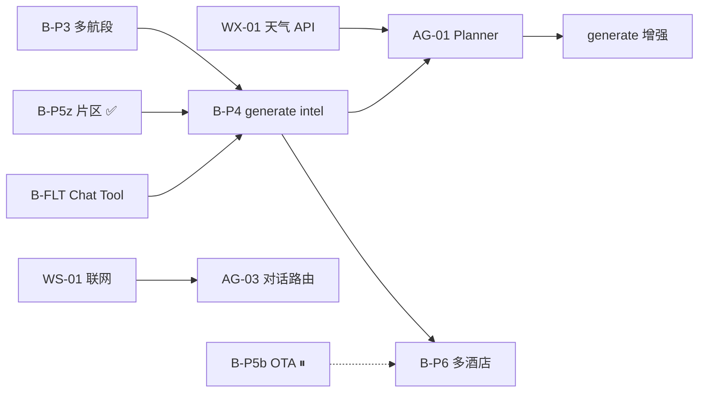

# 机酒 / LLM 数据 — 待办清单

← [总索引](../TODO.md) · [README](./README.md) · [06-机酒流程](./06-机酒确认与行程生成流程方案.md)

> **更新**：2026-08-07（`drag_dev2` Wave 1–2 落地；对照 [分析报告](../分析报告-travelAI-drag_dev.md) 补录仍存缺口）  
> **ID 前缀**：`SEC-` / `DATA-` / `B-` / `GEO-` / `WX-` / `WS-` / `AG-` · 状态：🔲 开放 · ⏸ 暂停 · ✅ 完成 · 🔧 进行中

---

## 0. 安全 / 合规 `SEC-*`（分析报告 V1 / V18 · **未在 Wave 1–2 覆盖**）

| ID | 状态 | 优先级 | 待办 | 关联文档 |
|----|------|--------|------|----------|
| **SEC-01** | ✅ | **P0** | 已 `git rm --cached` + `.gitignore`；**若曾 push 远端仍需轮换相关账号**（历史 blob 可能残留） | [分析报告 V1](../分析报告-travelAI-drag_dev.md) |
| **SEC-02** | 🔲 | P2 | 公网部署前：generate 鉴权或限速；收紧 CORS（当前 `allow_credentials=True` + 无 auth，本地可接受） | [分析报告 V18](../分析报告-travelAI-drag_dev.md) · `main.py` |

---

## 0b. 地理编码可用性 `GEO-*`（主诉 · 2026-08-06）

> 纠偏全文：[16-产品能力优先级纠偏分析.md](./16-产品能力优先级纠偏分析.md)

| ID | 状态 | 优先级 | 待办 | 关联文档 |
|----|------|--------|------|----------|
| **GEO-01** | ✅ | **P0** | 目的地围栏 + Top1 距离校验（`GEOCODE_FENCE_KM`，默认 150） | [17 §3](./17-用户决策回应与Geocode机酒重排.md) · `geocoding.py` |
| **GEO-02** | ✅ | P0 | Nominatim/Photon 超时 + batch `meta.warnings`（失败/出围栏） | [17 §3.3](./17-用户决策回应与Geocode机酒重排.md) · `test_geocode_fence.py` |
| **GEO-03** | 🔲 | P1 | 和风城市中心；中文名英译变体；可选 Places/Mapbox | [17 §3.3](./17-用户决策回应与Geocode机酒重排.md) |
| **GEO-04** | ✅ | **P0** | `backend/app/data/` 已在仓库跟踪；根 `.gitignore` 仅 `/data/` | [17 §3.2](./17-用户决策回应与Geocode机酒重排.md) |
| **GEO-05** | 🔲 | P1 | NodeCoordEditor debounce 自动联想（或文案标明仅按钮搜索） | [17 §3.2](./17-用户决策回应与Geocode机酒重排.md) |

### 酒店源 `HOT-*`

| ID | 状态 | 优先级 | 待办 | 关联文档 |
|----|------|--------|------|----------|
| **HOT-01** | 🔲 | P1 | 验证 Hotelbeds / Trip Partner 酒店搜索是否可申请与沙箱 | [17 §2](./17-用户决策回应与Geocode机酒重排.md) · [02](./02-酒店信息.md) |
| **HOT-02** | 🔲 | P2 | 片区内 lodging（Places）距离排序 + 深链价（过渡） | [17 §2.3](./17-用户决策回应与Geocode机酒重排.md) |
| **HOT-03** | 🔲 | P1 | 每晚预算带 UI；有库存前：片区+Trip 深链（不自动打开）；有 API 后位置>价格 | [18 §1/§6](./18-机酒优先与迭代行程产品决策.md) · [17 §5](./17-用户决策回应与Geocode机酒重排.md) |
| **FLT-RANK-01** | ✅ | **P0** | `balanced` = 价:时:中转:到达 **0.5:0.2:0.2:0.1** | [18 §5.3](./18-机酒优先与迭代行程产品决策.md) · `rank.py` |
| **FLOW-01** | ✅ | **P0** | 无确认航班阻断首次精排（**前端**）；Trip.com 以 `<a target="_blank">` 展示 | [18 §2/§4.3](./18-机酒优先与迭代行程产品决策.md) |
| **FLOW-01b** | ✅ | P1 | **后端** generate/stream 无 flights → 400；深链「不自动 open」全量审计仍待 | [分析报告 V3 残余](../分析报告-travelAI-drag_dev.md) · `itineraries.py` |
| **FLOW-02** | 🔲 | P1 | 改机酒后提示 + `optimize` / `regenerate` 模式（迭代行程） | [18 §4](./18-机酒优先与迭代行程产品决策.md) |
| **FLT-RANK-02** | 🔲 | P2 | UI/文案固定「参考价，以 OTA 为准」；确认用户口径与 5:2:2:1 一致（权重已落地） | [17 §5.2](./17-用户决策回应与Geocode机酒重排.md) · 分析报告 V12 |

---

## 0c. 生成数据契约 `DATA-*`（分析报告 V5–V11 / V14 / V16–V17 · **仍存在且原 TODO 未收**）

> 来源：[前端数据格式与Mock对照分析 §6](../前端数据格式与Mock对照分析.md) · [分析报告 §3 P1](../分析报告-travelAI-drag_dev.md)  
> 代码核验（2026-08-07）：`date.today()` / `timezone=Asia/Singapore` 仍硬编码；双 Mock 漂移；compact/FormPatch/LLM schema 仍瘦。

| ID | 状态 | 优先级 | 待办 | 关联文档 |
|----|------|--------|------|----------|
| **DATA-01** | ✅ | **P0** | `_llm_to_itinerary` 用 `TripRequest.date_start` 推 `days[].date` | [前端数据格式 §6.4](../前端数据格式与Mock对照分析.md) · `test_itinerary_dates.py` |
| **DATA-02** | 🔧 | P1 | `timezone` 粗映射已接（SG/JP/TH/KR/CN）；未覆盖城市仍 `UTC`，待完整表 | [前端数据格式 §6.5](../前端数据格式与Mock对照分析.md) · 分析报告 V5 |
| **DATA-03** | 🔲 | P1 | 统一前后端 Mock 单一源；修 Mock 日期不连续（缺 10-17） | [前端数据格式 §6.1/§3.3](../前端数据格式与Mock对照分析.md) · 分析报告 V7/V16 |
| **DATA-04** | 🔲 | P1 | generate/geocode 出参 Pydantic `Itinerary`（替换 `dict[str, Any]`） | [前端数据格式 §6.2](../前端数据格式与Mock对照分析.md) · 分析报告 V9 |
| **DATA-05** | 🔲 | P1 | LLM schema/prompt：可选 `tags` / `scene_group` / `alternative` 边 | [前端数据格式 §6.6](../前端数据格式与Mock对照分析.md) · 分析报告 V10 |
| **DATA-06** | 🔲 | P1 | `compactItineraryForParse` 补 tips/cost_label/scene_group；FormPatch 白名单加 `scene_group`/`duration_minutes`/`address` | [前端数据格式 §6.9–6.10](../前端数据格式与Mock对照分析.md) · 分析报告 V8 |
| **DATA-07** | 🔲 | P2 | `region` 别名归一化（市中心/市区/CBD） | [前端数据格式 §6.13](../前端数据格式与Mock对照分析.md) · 分析报告 V11 |
| **DATA-08** | 🔲 | P2 | 文档/契约对齐：`travel_plans_v1` 键名遗留 vs 实际 `STORAGE_VERSION=3` | [前端数据格式 §2.1](../前端数据格式与Mock对照分析.md) · 分析报告 V14 |
| **DATA-09** | 🔲 | P2 | 天气/联网接通前：前端标注 tips/开放时间「未联网核实」；禁编票价落到代码（配合 **B-FLT-02**） | [分析报告 V13](../分析报告-travelAI-drag_dev.md) · [15](./15-天气联网与决策Agent缺口分析.md) |
| **DATA-10** | 🔲 | P3 | 可选 `place_id` / 跨天 POI 去重 | [前端数据格式 §6.11](../前端数据格式与Mock对照分析.md) · 分析报告 V17 |

---

## 1. 阶段 B 主链路（P3–P6）

| ID | 状态 | 优先级 | 待办 | 关联文档 |
|----|------|--------|------|----------|
| **B-P3-01** | 🔲 | P1 | 多航段航班 UI：sequence、往返/多城/城际模板 | [06 §7 P3](./06-机酒确认与行程生成流程方案.md) · [开发进度 §Todo](../开发进度.md) |
| **B-P3-02** | 🔲 | P2 | 城际航段快捷入口（`role: intercity` 模板化） | [06 §7 P3](./06-机酒确认与行程生成流程方案.md) |
| **B-P4-01** | ✅ | **P0** | generate 注入 `travel_intel.flights[]` 硬约束（API + Prompt） | [06 §7 P4](./06-机酒确认与行程生成流程方案.md) · [18](./18-机酒优先与迭代行程产品决策.md) |
| **B-P4-02** | ✅ | P0 | generate Prompt：已确认 **住宿片区 / hotel** 作区域约束 | [12 §9 P4](./12-阶段B住宿区域倒推方案.md) · `itinerary_llm.py` |
| **B-P4-03** | ✅ | P0 | 无航班阻断 generate；无酒店/片区 warning；`shouldAutoGenerate` 要求航班 | [18 §4.3](./18-机酒优先与迭代行程产品决策.md) |
| **B-P4-04** | 🔲 | P1 | Itinerary meta 可选绑定 `quote_id` / intel 快照 | [01-Trip.com §Phase2](./01-航班信息-Trip.com实施方案.md) |
| **B-P6-01** | 🔲 | P2 | 多酒店换店 + 日期/城市校验 | [06 §7 P6](./06-机酒确认与行程生成流程方案.md) |
| **B-P6-02** | 🔲 | P2 | 「同城多酒店换店」手工录入规则（Phase 1 是否支持） | [06 §9 待细化](./06-机酒确认与行程生成流程方案.md) |

---

## 2. 航班 — Chat / Tool / 增强

| ID | 状态 | 优先级 | 待办 | 关联文档 |
|----|------|--------|------|----------|
| **B-FLT-01** | 🔲 | P1 | Chat Tool `search_flights` 改调 Ignav（对话内按需搜价） | [01-Trip.com §Phase2](./01-航班信息-Trip.com实施方案.md) · [Ignav验证报告](./01-航班信息-Ignav验证报告.md) |
| **B-FLT-02** | 🔲 | P1 | Prompt 分支：禁止编造票价；Tool 结果带来源标签 | [01-Trip.com §Phase2](./01-航班信息-Trip.com实施方案.md) |
| **B-FLT-03** | 🔲 | P2 | `parseTripcomSearchUrl` 预填手动添加表单 | [09 §6](./09-阶段B航班功能实施计划.md) |
| **B-FLT-04** | 🔲 | P2 | 后端 `POST /flights/manual-validate`（时刻/机场合理性） | [09 §6](./09-阶段B航班功能实施计划.md) · [08-手动添加](./08-手动添加航班方案.md) |
| **B-FLT-05** | 🔲 | P3 | `FlightVerifyApp` 表格加中文航线列 | [09 §6](./09-阶段B航班功能实施计划.md) |
| **B-FLT-06** | 🔲 | P3 | 构建脚本 `sync-airport-labels`（`city_codes.json` → TS） | [09 §6](./09-阶段B航班功能实施计划.md) · [07-中文地名](./07-航班号与中文地名分析.md) |
| **B-FLT-07** | 🔲 | P3 | Trip.com 深链无痕验证：PVG→SIN 日期参数（人工 QA） | [01-Trip.com §验收](./01-航班信息-Trip.com实施方案.md) |
| **B-FLT-08** | ⏸ | — | `flight-verify.html` dev 页能力合并进主流程或废弃 | [06 §2 现状](./06-机酒确认与行程生成流程方案.md) |

---

## 3. 住宿 — P5b 与对称方案（⏸ / 已替代）

> **说明**：主路径已改为 **P5z 片区倒推**（✅ [13](./13-阶段B住宿区域实施计划.md)）。下列 **P5a 对称搜价** 项仅作历史参考，**不排期** unless 产品重启 P5b。

| ID | 状态 | 优先级 | 待办 | 关联文档 |
|----|------|--------|------|----------|
| **B-P5b-01** | ⏸ | — | OTA ranked 酒店搜价 + stale-while-revalidate | [13 §1#14](./13-阶段B住宿区域实施计划.md) · [11 §P5b](./11-阶段B酒店对称方案分析.md) |
| **B-P5b-02** | ⏸ | — | `leftPanelMode: 'hotel'` 对称 flight（搜价壳） | [11 §验收](./11-阶段B酒店对称方案分析.md) |
| **B-P5a-*** | — | — | ~~手动 hotel Panel 对称方案~~ → **已由 P5z `stay` 模式替代** | [11](./11-阶段B酒店对称方案分析.md) · [12](./12-阶段B住宿区域倒推方案.md) |

### P5z 验收勾项（源文档待同步 ✅）

以下已在 [13 §1](./13-阶段B住宿区域实施计划.md) 标记完成；[12 §5.1 验收](./12-阶段B住宿区域倒推方案.md) 清单 **待改为 ✅**：

| ID | 状态 | 项 |
|----|------|-----|
| B-P5z-V01 | ✅ | 地图可见推荐片区 circle |
| B-P5z-V02 | ✅ | 确认片区 → 添加 hotel 节点 |
| B-P5z-V03 | ✅ | geocode 失败 → map pick |
| B-P5z-V04 | ✅ | hotel 节点 ↔ intel 双向同步 |

---

## 4. 天气 / 联网 / 决策 Agent（缺口 · 2026-08-06）

> 分析全文：[15-天气联网与决策Agent缺口分析.md](./15-天气联网与决策Agent缺口分析.md)

### 4.1 天气 `WX-*`（⏸ 产品暂缓 · 非当前主线）

| ID | 状态 | 优先级 | 待办 | 关联文档 |
|----|------|--------|------|----------|
| **WX-01** | ⏸ | — | **和风天气** Geo + 每日预报；`weather.source=api`；icon 映射 | [15 §1.3](./15-天气联网与决策Agent缺口分析.md) · [16](./16-产品能力优先级纠偏分析.md) |
| **WX-02** | ⏸ | — | generate / Planner 前批量拉行程日期天气并注入 Prompt | [15 §5 WX-a](./15-天气联网与决策Agent缺口分析.md) |
| **WX-03** | 🔲 | P1 | Chat `fetch_weather` 可执行 + Patch 确认 UI | [15 §1.4](./15-天气联网与决策Agent缺口分析.md) · [OV-04](../TODO-路线图与总览.md) |
| **WX-04** | 🔲 | P2 | 雨天 rain_plan / 室内备选（可调和风指数/预警） | [15 §1](./15-天气联网与决策Agent缺口分析.md) · [05](./05-行前细节清单.md) |

### 4.2 联网查询 `WS-*`

| ID | 状态 | 优先级 | 待办 | 关联文档 |
|----|------|--------|------|----------|
| **WS-01** | 🔲 | P1 | **Tavily** REST `search` 封装 + 有限轮 tool loop | [15 §2.3](./15-天气联网与决策Agent缺口分析.md) · [docs.tavily.com](https://docs.tavily.com/) |
| **WS-02** | 🔲 | P1 | 联网结果 `provenance`；禁止用于编造票价 | [15 §2.2](./15-天气联网与决策Agent缺口分析.md) · [00 §3.2](./00-概述与架构.md) |
| **WS-03** | 🔲 | P2 | generate / tips / 开放时间场景按需调用 Tavily | [15 §4 矩阵](./15-天气联网与决策Agent缺口分析.md) · [03](./03-游玩项目.md) |
| **WS-04** | ✅ | P1 | 精排前 `EvidencePack`（TikHub）注入 generate；`meta.evidence[]` | [19 §4/§8](./19-玩法印证与UGC数据源分析.md) · `ugc/` |
| **WS-05** | 🔲 | P1 | Tavily 权威 `include_domains` 辅源（TikHub 已为主） | [19 §4.1](./19-玩法印证与UGC数据源分析.md) |
| **WS-06** | 🔧 | P1 | 前端「参考依据」：已有 evidence toast；**侧栏链接列表待补** | [19 §4](./19-玩法印证与UGC数据源分析.md) |
| **WS-07** | ✅ | P1 | TikHub `search_notes` + `POST /ugc/evidence/preview`；粘贴链接抽 POI 待补 | [19 §8](./19-玩法印证与UGC数据源分析.md) |
| **WS-08** | 🔲 | P2 | Places（类型+评分+摘要）校验 UGC 候选 POI；不单独用评分排玩法 | [19 §7](./19-玩法印证与UGC数据源分析.md) |
| **WS-MCP** | 🔲 | P3 | 本机 Cursor 配置 Tavily MCP（开发辅助，非运行时） | [15 §2.3](./15-天气联网与决策Agent缺口分析.md) |

### 4.3 决策 Agent `AG-*`

| ID | 状态 | 优先级 | 待办 | 关联文档 |
|----|------|--------|------|----------|
| **AG-01** | ✅ | **P0** | 规则管道：evidence + travel_intel 注入 generate（非完整 Planner） | [15 §3.3 AG-1](./15-天气联网与决策Agent缺口分析.md) · **B-P4** / **WS-04** |
| **AG-02** | 🔲 | P1 | 决策→数据源矩阵落地为配置/代码（§4 表） | [15 §4](./15-天气联网与决策Agent缺口分析.md) |
| **AG-03** | 🔲 | P2 | 对话意图路由到 tools（天气/航班/联网） | [15 §3.3 AG-2](./15-天气联网与决策Agent缺口分析.md) |
| **AG-04** | 🔲 | P2 | Activity / Transit / Compliance Agent + KB YAML | [15 §5 AG-3](./15-天气联网与决策Agent缺口分析.md) · [04](./04-通勤与交通卡.md) · [05](./05-行前细节清单.md) |

---

## 5. 数据层 / 研究 / Skill

| ID | 状态 | 优先级 | 待办 | 关联文档 |
|----|------|--------|------|----------|
| **B-R-01** | ⏸ | — | Duffel Sandbox 补测（Tier C 正式 API） | [Spike验证报告 §3.4](./01-航班信息-Spike验证报告.md) |
| **B-R-02** | ⏸ | — | LetsFG 主 App 参考价接入（Ignav 已为主源） | [01-Trip.com §Phase3](./01-航班信息-Trip.com实施方案.md) |
| **B-SK-01** | 🔲 | P3 | 新建 Skill `travel-data-intelligence` | [README §4](./README.md) |
| **B-SK-02** | 🔲 | P3 | 境外知识库：新加坡 / 日本 / 泰国 YAML | [README §4](./README.md) · [05-行前清单](./05-行前细节清单.md) · **AG-04** |

---

## 6. 跨模块依赖图

**建议实施顺序（2026-08-07）**：

1. ~~`SEC-01`~~ ✅ · ~~`GEO-*` Wave~~ ✅ · ~~`B-P4` / `FLT-RANK` / `FLOW-01b` / `DATA-01`~~ ✅  
2. **`DATA-02` 完整 tz 表** → **`DATA-05`** → **`DATA-03/04/06`**  
3. **`WS-06`** 参考依据侧栏 · **`HOT-01/03`** · **`FLOW-02`**  
4. （⏸ **WX-*** / 多数 **WS-***）· **`SEC-02`** 仅部署前

> 详见 [17](./17-用户决策回应与Geocode机酒重排.md) · 缺口对照 [分析报告](../分析报告-travelAI-drag_dev.md)。

---

*清单版本：v1.3 · 2026-08-07 · 变更请同步 [总索引](../TODO.md)*
