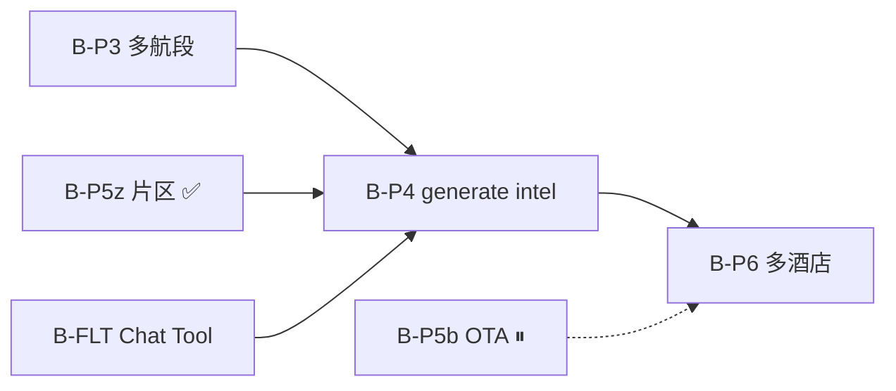

# 机酒 / LLM 数据 — 待办清单

← [总索引](../TODO.md) · [README](./README.md) · [06-机酒流程](./06-机酒确认与行程生成流程方案.md)

> **更新**：2026-07-05  
> **ID 前缀**：`B-`（阶段 B 机酒）· 状态：🔲 开放 · ⏸ 暂停 · ✅ 完成

---

## 1. 阶段 B 主链路（P3–P6）

| ID | 状态 | 优先级 | 待办 | 关联文档 |
|----|------|--------|------|----------|
| **B-P3-01** | 🔲 | P1 | 多航段航班 UI：sequence、往返/多城/城际模板 | [06 §7 P3](./06-机酒确认与行程生成流程方案.md) · [开发进度 §Todo](../开发进度.md) |
| **B-P3-02** | 🔲 | P2 | 城际航段快捷入口（`role: intercity` 模板化） | [06 §7 P3](./06-机酒确认与行程生成流程方案.md) |
| **B-P4-01** | 🔲 | **P0** | `POST /itineraries/generate` 注入 `travel_intel.flights[]` 硬约束（时刻/机场锚点） | [06 §7 P4](./06-机酒确认与行程生成流程方案.md) · [09 §6](./09-阶段B航班功能实施计划.md) · [Ignav验证报告 §下一步](./01-航班信息-Ignav验证报告.md) |
| **B-P4-02** | 🔲 | P0 | generate Prompt：已确认 **住宿片区 / hotel 节点** 作区域约束 | [12 §9 P4](./12-阶段B住宿区域倒推方案.md) · [13 §7 依赖](./13-阶段B住宿区域实施计划.md) |
| **B-P4-03** | 🔲 | P1 | generate `meta.warnings`：未确认机酒时的强提示（与产品决策 B 一致） | [06 §8.1](./06-机酒确认与行程生成流程方案.md) |
| **B-P4-04** | 🔲 | P1 | Itinerary meta 可选绑定 `quote_id` / intel 快照 | [01-Trip.com §Phase2](./01-航班信息-Trip.com实施方案.md) |
| **B-P6-01** | 🔲 | P2 | 多酒店换店 + 日期/城市校验 | [06 §7 P6](./06-机酒确认与行程生成流程方案.md) |
| **B-P6-02** | 🔲 | P2 | 「同城多酒店换店」手工录入规则（Phase 1 是否支持） | [06 §9 待细化](./06-机酒确认与行程生成流程方案.md) |

---

## 2. 航班 — Chat / Tool / 增强

| ID | 状态 | 优先级 | 待办 | 关联文档 |
|----|------|--------|------|----------|
| **B-FLT-01** | 🔲 | P1 | Chat Tool `search_flights` 改调 Ignav（对话内按需搜价） | [01-Trip.com §Phase2](./01-航班信息-Trip.com实施方案.md) · [Ignav验证报告](./01-航班信息-Ignav验证报告.md) |
| **B-FLT-02** | 🔲 | P1 | Prompt 分支：禁止编造票价；Tool 结果带来源标签 | [01-Trip.com §Phase2](./01-航班信息-Trip.com实施方案.md) |
| **B-FLT-03** | 🔲 | P2 | `parseTripcomSearchUrl` 预填手动添加表单 | [09 §6](./09-阶段B航班功能实施计划.md) |
| **B-FLT-04** | 🔲 | P2 | 后端 `POST /flights/manual-validate`（时刻/机场合理性） | [09 §6](./09-阶段B航班功能实施计划.md) · [08-手动添加](./08-手动添加航班方案.md) |
| **B-FLT-05** | 🔲 | P3 | `FlightVerifyApp` 表格加中文航线列 | [09 §6](./09-阶段B航班功能实施计划.md) |
| **B-FLT-06** | 🔲 | P3 | 构建脚本 `sync-airport-labels`（`city_codes.json` → TS） | [09 §6](./09-阶段B航班功能实施计划.md) · [07-中文地名](./07-航班号与中文地名分析.md) |
| **B-FLT-07** | 🔲 | P3 | Trip.com 深链无痕验证：PVG→SIN 日期参数（人工 QA） | [01-Trip.com §验收](./01-航班信息-Trip.com实施方案.md) |
| **B-FLT-08** | ⏸ | — | `flight-verify.html` dev 页能力合并进主流程或废弃 | [06 §2 现状](./06-机酒确认与行程生成流程方案.md) |

---

## 3. 住宿 — P5b 与对称方案（⏸ / 已替代）

> **说明**：主路径已改为 **P5z 片区倒推**（✅ [13](./13-阶段B住宿区域实施计划.md)）。下列 **P5a 对称搜价** 项仅作历史参考，**不排期** unless 产品重启 P5b。

| ID | 状态 | 优先级 | 待办 | 关联文档 |
|----|------|--------|------|----------|
| **B-P5b-01** | ⏸ | — | OTA ranked 酒店搜价 + stale-while-revalidate | [13 §1#14](./13-阶段B住宿区域实施计划.md) · [11 §P5b](./11-阶段B酒店对称方案分析.md) |
| **B-P5b-02** | ⏸ | — | `leftPanelMode: 'hotel'` 对称 flight（搜价壳） | [11 §验收](./11-阶段B酒店对称方案分析.md) |
| **B-P5a-*** | — | — | ~~手动 hotel Panel 对称方案~~ → **已由 P5z `stay` 模式替代** | [11](./11-阶段B酒店对称方案分析.md) · [12](./12-阶段B住宿区域倒推方案.md) |

### P5z 验收勾项（源文档待同步 ✅）

以下已在 [13 §1](./13-阶段B住宿区域实施计划.md) 标记完成；[12 §5.1 验收](./12-阶段B住宿区域倒推方案.md) 清单 **待改为 ✅**：

| ID | 状态 | 项 |
|----|------|-----|
| B-P5z-V01 | ✅ | 地图可见推荐片区 circle |
| B-P5z-V02 | ✅ | 确认片区 → 添加 hotel 节点 |
| B-P5z-V03 | ✅ | geocode 失败 → map pick |
| B-P5z-V04 | ✅ | hotel 节点 ↔ intel 双向同步 |

---

## 4. 数据层 / 研究 / Skill

| ID | 状态 | 优先级 | 待办 | 关联文档 |
|----|------|--------|------|----------|
| **B-R-01** | ⏸ | — | Duffel Sandbox 补测（Tier C 正式 API） | [Spike验证报告 §3.4](./01-航班信息-Spike验证报告.md) |
| **B-R-02** | ⏸ | — | LetsFG 主 App 参考价接入（Ignav 已为主源） | [01-Trip.com §Phase3](./01-航班信息-Trip.com实施方案.md) |
| **B-SK-01** | 🔲 | P3 | 新建 Skill `travel-data-intelligence` | [README §4](./README.md) |
| **B-SK-02** | 🔲 | P3 | 境外知识库：新加坡 / 日本 / 泰国 YAML | [README §4](./README.md) · [05-行前清单](./05-行前细节清单.md) |

---

## 5. 跨模块依赖图

**建议实施顺序**：`B-P4-01/02` → `B-P3-01` → `B-FLT-01` → `B-P6-01`

---

*清单版本：v1.0 · 2026-07-05 · 变更请同步 [总索引](../TODO.md)*
